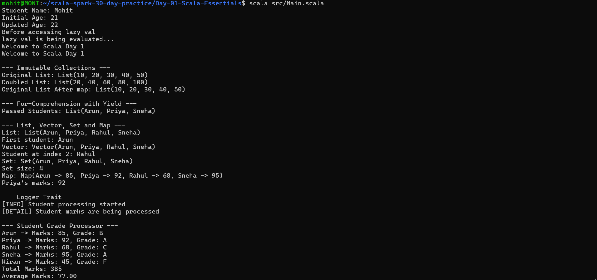

# Day 1 - Scala Essentials

## Objective

Practice the fundamental concepts of Scala including variables, immutable collections, for-comprehensions, collection types, traits, and basic data processing.

---

## Topics Covered

### 1. val, var and lazy val

Scala provides different ways to define variables.

#### val

`val` creates an immutable variable. Once assigned, it cannot be reassigned.

Example:

```scala
val studentName = "Mohit"
```

#### var

`var` creates a mutable variable. Its value can be changed after assignment.

Example:

```scala
var studentAge = 21
studentAge = 22
```

#### lazy val

`lazy val` is evaluated only when it is accessed for the first time.

Example:

```scala
lazy val studentMessage = {
  println("lazy val is being evaluated...")
  "Welcome to Scala Day 1"
}
```

The value is evaluated only when `studentMessage` is accessed.

### Output

```text
Student Name: Mohit
Initial Age: 21
Updated Age: 22
Before accessing lazy val
lazy val is being evaluated...
Welcome to Scala Day 1
Welcome to Scala Day 1
```

Notice that:

```text
lazy val is being evaluated...
```

appears only once even though `studentMessage` is accessed twice.

---

## 2. Immutable Collections

Scala provides immutable collections where operations create new collections instead of modifying the original collection.

A `List` was used with the `map` operation.

Example:

```scala
val numbers = List(10, 20, 30, 40, 50)

val doubledNumbers = numbers.map(_ * 2)
```

### Output

```text
Original List: List(10, 20, 30, 40, 50)
Doubled List: List(20, 40, 60, 80, 100)
Original List After map: List(10, 20, 30, 40, 50)
```

The original list remains unchanged after `map`.

This demonstrates immutability in Scala.

---

## 3. For-Comprehension with yield

A `for`-comprehension was used with `yield` to process student marks.

Students who scored 70 or more were selected.

Example:

```scala
val students = List(
  ("Arun", 85),
  ("Priya", 92),
  ("Rahul", 68),
  ("Sneha", 95)
)

val passedStudents = for {
  (name, marks) <- students
  if marks >= 70
} yield name
```

### Output

```text
Passed Students: List(Arun, Priya, Sneha)
```

Rahul was not included because his marks were 68.

### Why `yield` is used

`yield` produces a new collection from the values generated by the `for`-comprehension.

---

## 4. List, Vector, Set and Map

Four important Scala collection types were practiced:

- List
- Vector
- Set
- Map

---

### List

A `List` is an ordered collection.

Example:

```scala
val studentList = List("Arun", "Priya", "Rahul", "Sneha")
```

Output:

```text
List: List(Arun, Priya, Rahul, Sneha)
First student: Arun
```

The first element can be accessed using:

```scala
studentList.head
```

---

### Vector

A `Vector` is an indexed collection that provides efficient access by index.

Example:

```scala
val studentVector = Vector("Arun", "Priya", "Rahul", "Sneha")
```

Output:

```text
Vector: Vector(Arun, Priya, Rahul, Sneha)
Student at index 2: Rahul
```

The element at index 2 can be accessed using:

```scala
studentVector(2)
```

---

### Set

A `Set` stores unique values.

Example:

```scala
val studentSet = Set("Arun", "Priya", "Rahul", "Sneha", "Arun")
```

Output:

```text
Set: Set(Arun, Priya, Rahul, Sneha)
Set size: 4
```

The duplicate `Arun` is removed automatically.

---

### Map

A `Map` stores data as key-value pairs.

Example:

```scala
val studentMarks = Map(
  "Arun" -> 85,
  "Priya" -> 92,
  "Rahul" -> 68,
  "Sneha" -> 95
)
```

Output:

```text
Map: Map(Arun -> 85, Priya -> 92, Rahul -> 68, Sneha -> 95)
Priya's marks: 92
```

A value can be accessed using its key:

```scala
studentMarks("Priya")
```

---

## 5. Logger Trait

A Scala `trait` was created to define common logging behavior.

The logging functionality was implemented using two classes.

Example concept:

```scala
trait Logger {
  def log(message: String): Unit
}
```

Two implementations were used:

- Console logger
- Detailed logger

### Output

```text
--- Logger Trait ---
[INFO] Student processing started
[DETAIL] Student marks are being processed
```

The trait provides a common structure, while different classes can provide their own implementation.

---

## 6. Student Grade Processor

A small student-grade processing program was created using Scala collections.

The program:

1. Stores student names and marks.
2. Determines grades.
3. Calculates total marks.
4. Calculates average marks.

### Student Results

```text
--- Student Grade Processor ---

Arun -> Marks: 85, Grade: B
Priya -> Marks: 92, Grade: A
Rahul -> Marks: 68, Grade: C
Sneha -> Marks: 95, Grade: A
Kiran -> Marks: 45, Grade: F
```

### Summary

```text
Total Marks: 385
Average Marks: 77.00
```

This demonstrates how basic Scala collections and functions can be used for simple data processing.

---

## Complete Output

The final program produced the following output:

```text
Student Name: Mohit
Initial Age: 21
Updated Age: 22
Before accessing lazy val
lazy val is being evaluated...
Welcome to Scala Day 1
Welcome to Scala Day 1

--- Immutable Collections ---
Original List: List(10, 20, 30, 40, 50)
Doubled List: List(20, 40, 60, 80, 100)
Original List After map: List(10, 20, 30, 40, 50)

--- For-Comprehension with Yield ---
Passed Students: List(Arun, Priya, Sneha)

--- List, Vector, Set and Map ---
List: List(Arun, Priya, Rahul, Sneha)
First student: Arun
Vector: Vector(Arun, Priya, Rahul, Sneha)
Student at index 2: Rahul
Set: Set(Arun, Priya, Rahul, Sneha)
Set size: 4
Map: Map(Arun -> 85, Priya -> 92, Rahul -> 68, Sneha -> 95)
Priya's marks: 92

--- Logger Trait ---
[INFO] Student processing started
[DETAIL] Student marks are being processed

--- Student Grade Processor ---
Arun -> Marks: 85, Grade: B
Priya -> Marks: 92, Grade: A
Rahul -> Marks: 68, Grade: C
Sneha -> Marks: 95, Grade: A
Kiran -> Marks: 45, Grade: F
Total Marks: 385
Average Marks: 77.00
```

---

## Project Structure

```text
Day-01-Scala-Essentials/
│
├── src/
│   └── Main.scala
│
├── screenshots/
│   └── final_output.png
│
└── README.md
```

---

## Execution

The Scala program was executed using the WSL terminal.

Command:

```bash
scala src/Main.scala
```

The program executed successfully and produced the expected output.

---

## Screenshot


The final output screenshot is stored in:



---

## Result

Day 1 - Scala Essentials was completed successfully.

The following Scala concepts were practiced:

- `val`
- `var`
- `lazy val`
- Immutable collections
- `map`
- For-comprehension
- `yield`
- `List`
- `Vector`
- `Set`
- `Map`
- Traits
- Basic student data processing
- Total and average calculation