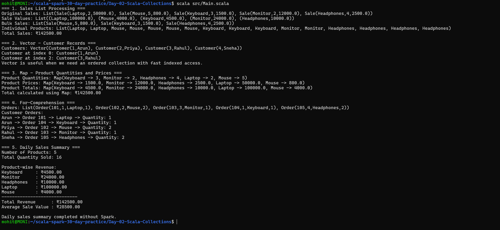

# Day 2 - Scala Collections Practice

## Objective

Practice Scala collections and collection operations by processing sales data, customer records, product information, and orders without using Apache Spark.

## Topics Covered

### 1. Sales List Processing

A `List` of sales records was created containing:

- Product name
- Quantity sold
- Price per unit

The following collection operations were practiced:

- `map`
- `filter`
- `flatMap`
- `reduce`

#### Map

`map` was used to calculate the total value of each sale.

```scala
sales.map(sale => (sale.product, sale.quantity * sale.price))
```

Example:

```text
Laptop -> 100000
Mouse -> 4000
Keyboard -> 4500
Monitor -> 24000
Headphones -> 10000
```

#### Filter

`filter` was used to select bulk sales where the quantity was greater than 3.

Example:

```text
Mouse
Keyboard
Headphones
```

#### FlatMap

`flatMap` was used to expand each sale into individual product entries based on quantity.

Example:

```text
Laptop, Laptop,
Mouse, Mouse, Mouse, Mouse, Mouse,
Keyboard, Keyboard, Keyboard,
Monitor, Monitor,
Headphones, Headphones, Headphones, Headphones
```

#### Reduce

`reduce` was used to calculate the total sales value.

```text
Total Sales: ₹142500.00
```

---

## 2. Vector - Customer Records

A `Vector` was used to store ordered customer records.

```text
Vector(
  Customer(1, Arun),
  Customer(2, Priya),
  Customer(3, Rahul),
  Customer(4, Sneha)
)
```

Indexed access was demonstrated using customer indexes.

```text
Customer at index 0: Customer(1,Arun)
Customer at index 2: Customer(3,Rahul)
```

### Why Vector is Useful

`Vector` is useful when we need:

- An ordered collection
- Fast indexed access
- Efficient access to elements by position

---

## 3. Map - Product Quantities and Prices

A `Map` was used to store product quantities and product prices.

### Product Quantities

```text
Keyboard -> 3
Monitor -> 2
Headphones -> 4
Laptop -> 2
Mouse -> 5
```

### Product Prices

```text
Keyboard -> ₹1500
Monitor -> ₹12000
Headphones -> ₹2500
Laptop -> ₹50000
Mouse -> ₹800
```

### Product Totals

The quantity and price maps were combined to calculate product-wise revenue.

```text
Keyboard    : ₹4500.00
Monitor     : ₹24000.00
Headphones  : ₹10000.00
Laptop      : ₹100000.00
Mouse       : ₹4000.00
```

Total calculated using Map:

```text
₹142500.00
```

---

## 4. For-Comprehension - Customers and Orders

A `for`-comprehension was used to combine customer records with their corresponding orders.

### Customers

```text
Arun
Priya
Rahul
Sneha
```

### Orders

```text
Order(101, 1, Laptop, 1)
Order(102, 2, Mouse, 2)
Order(103, 3, Monitor, 1)
Order(104, 1, Keyboard, 1)
Order(105, 4, Headphones, 2)
```

### Customer Orders

```text
Arun -> Order 101 -> Laptop -> Quantity: 1
Arun -> Order 104 -> Keyboard -> Quantity: 1
Priya -> Order 102 -> Mouse -> Quantity: 2
Rahul -> Order 103 -> Monitor -> Quantity: 1
Sneha -> Order 105 -> Headphones -> Quantity: 2
```

This demonstrates how a `for`-comprehension can combine data from multiple collections.

---

## 5. Daily Sales Summary

A daily sales summary was produced without using Apache Spark.

### Summary

```text
Number of Products: 5
Total Quantity Sold: 16

Product-wise Revenue:

Keyboard    : ₹4500.00
Monitor     : ₹24000.00
Headphones  : ₹10000.00
Laptop      : ₹100000.00
Mouse       : ₹4000.00

Total Revenue      : ₹142500.00
Average Sale Value : ₹28500.00
```

The summary was calculated using Scala collection operations.

---

## Execution

The program was executed from the Day 2 project directory using:

```bash
scala src/Main.scala
```

The program completed successfully and displayed the expected sales processing, customer records, product maps, customer orders, and daily sales summary.

---

## Screenshot

The final program output is stored in:

```text
screenshots/final_output.png
```



---

## Result

Day 2 - Scala Collections Practice was completed successfully.

The following concepts were practiced:

- `List`
- `map`
- `filter`
- `flatMap`
- `reduce`
- `Vector`
- `Map`
- For-comprehension
- Customer and order data processing
- Product-wise revenue calculation
- Daily sales summary
- Scala collection processing without Spark