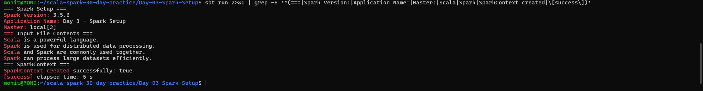
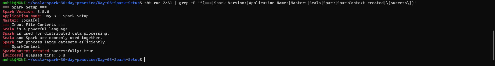

# Day 3 — Spark Setup and First Application

## Objective

Set up a Scala Spark project using sbt, create a SparkSession and SparkContext, read a text file, and run the application in local mode using 2 and 4 cores.

---

## 1. Create a Scala Spark Project with sbt

A Scala Spark project was created using sbt.

### Technologies Used

- Scala 2.12.18
- Apache Spark 3.5.6
- sbt 2.0.7
- Java 17
- Ubuntu WSL2

### Project Structure

```text
Day-03-Spark-Setup/
├── build.sbt
├── README.md
├── data/
│   └── input.txt
├── screenshots/
│   ├── local-2-output.png
│   └── local-4-output.png
└── src/
    └── main/
        └── scala/
            └── Main.scala
```

---

## 2. Create SparkSession and SparkContext

A SparkSession was created using:

```scala
val spark = SparkSession.builder()
  .appName("Day 3 - Spark Setup")
  .master("local[2]")
  .getOrCreate()
```

The SparkContext was obtained from the SparkSession:

```scala
val sc = spark.sparkContext
```

The application displays the Spark version, application name, master configuration, and SparkContext status.

### Output

```text
=== Spark Setup ===
Spark Version: 3.5.6
Application Name: Day 3 - Spark Setup
Master: local[2]
```

---

## 3. Read a Text File and Display Its Contents

The input file is stored in:

```text
data/input.txt
```

The application reads the text file using Spark:

```scala
val lines = sc.textFile("data/input.txt")
```

The contents are displayed using:

```scala
lines.collect().foreach(println)
```

### Input File

```text
Scala is a powerful language.
Spark is used for distributed data processing.
Scala and Spark are commonly used together.
Spark can process large datasets efficiently.
```

### Output

```text
=== Input File Contents ===
Scala is a powerful language.
Spark is used for distributed data processing.
Scala and Spark are commonly used together.
Spark can process large datasets efficiently.
```

---

## 4. Driver, Executor and Cluster Manager

### Driver

The Driver is the main process of a Spark application.

It is responsible for:

- Creating the SparkSession and SparkContext.
- Creating and scheduling jobs.
- Dividing jobs into stages and tasks.
- Communicating with executors.

### Executor

An Executor runs the tasks assigned by the Driver.

It is responsible for:

- Executing tasks.
- Processing data.
- Storing cached data.
- Returning results to the Driver.

### Cluster Manager

The Cluster Manager manages and allocates resources for Spark applications.

Examples include:

- Standalone
- YARN
- Kubernetes

In local mode, Spark runs on the local machine.

---

## 5. Run the Application in Local Mode with 2 and 4 Cores

The same Spark application was executed using two different local configurations.

### Local Mode — 2 Cores

The application was configured with:

```scala
.master("local[2]")
```

The application executed successfully.

### Output

```text
=== Spark Setup ===
Spark Version: 3.5.6
Application Name: Day 3 - Spark Setup
Master: local[2]

=== Input File Contents ===
Scala is a powerful language.
Spark is used for distributed data processing.
Scala and Spark are commonly used together.
Spark can process large datasets efficiently.

=== SparkContext ===
SparkContext created successfully: true
[success] elapsed time: 5 s
```

### Screenshot



---

### Local Mode — 4 Cores

The same application was configured with:

```scala
.master("local[4]")
```

The application executed successfully.

### Output

```text
=== Spark Setup ===
Spark Version: 3.5.6
Application Name: Day 3 - Spark Setup
Master: local[4]

=== Input File Contents ===
Scala is a powerful language.
Spark is used for distributed data processing.
Scala and Spark are commonly used together.
Spark can process large datasets efficiently.

=== SparkContext ===
SparkContext created successfully: true
[success] elapsed time: 5 s
```

### Screenshot



---

## How to Run

Navigate to the Day 3 project directory:

```bash
cd ~/scala-spark-30-day-practice/Day-03-Spark-Setup
```

Run the application:

```bash
sbt run
```

To test with 2 cores:

```scala
.master("local[2]")
```

To test with 4 cores:

```scala
.master("local[4]")
```

---

## Result

The Day 3 Spark application was successfully completed.

The application successfully:

- Created a Scala Spark project using sbt.
- Created a SparkSession and SparkContext.
- Read and displayed a text file.
- Explained Driver, Executor, and Cluster Manager.
- Ran successfully in local mode with 2 cores.
- Ran successfully in local mode with 4 cores.

## Conclusion

Day 3 — Spark Setup and First Application was completed successfully using Scala, Apache Spark, sbt, and Java.