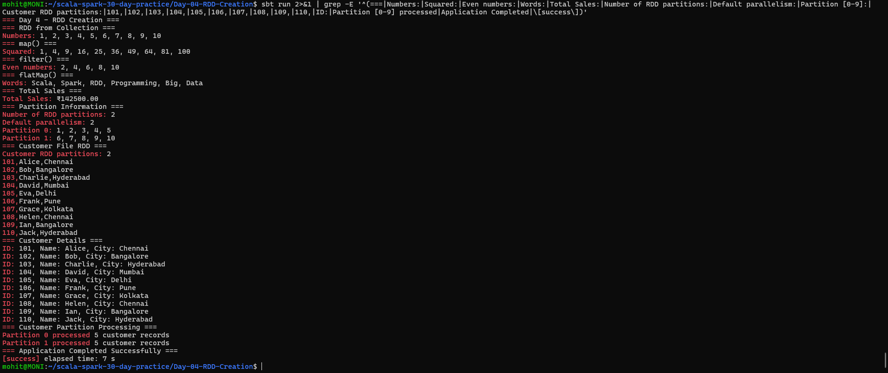

# Day 4 — RDD Creation

## Objective

Create and process RDDs using Scala and Apache Spark. The tasks include creating RDDs from collections and text files, applying RDD transformations, calculating total sales, inspecting partitions, and processing customer data across multiple partitions.

---

## 1. Create RDDs from Collections and Text Files

### RDD from Collection

An RDD was created from a Scala collection using `parallelize()`:

```scala
val numbers = List(1, 2, 3, 4, 5, 6, 7, 8, 9, 10)

val numberRDD = sc.parallelize(numbers)
```

### RDD from Text File

A customer RDD was created from a text file using `textFile()`:

```scala
val customerRDD = sc.textFile("data/customers.txt", 2)
```

The customer file contains customer ID, name, and city.

---

## 2. Use map, filter and flatMap on an RDD

### map()

The `map()` transformation was used to calculate the square of each number.

```scala
val squaredRDD = numberRDD.map(n => n * n)
```

Output:

```text
Squared: 1, 4, 9, 16, 25, 36, 49, 64, 81, 100
```

### filter()

The `filter()` transformation was used to select even numbers.

```scala
val evenRDD = numberRDD.filter(n => n % 2 == 0)
```

Output:

```text
Even numbers: 2, 4, 6, 8, 10
```

### flatMap()

The `flatMap()` transformation was used to split sentences into individual words.

```scala
val wordsRDD = sentencesRDD.flatMap(line => line.split(" "))
```

Output:

```text
Words: Scala, Spark, RDD, Programming, Big, Data
```

---

## 3. Calculate Total Sales from Transaction Records

Transaction records were stored in an RDD:

```scala
val transactions = List(
  ("Laptop", 2, 50000.0),
  ("Mouse", 5, 800.0),
  ("Keyboard", 3, 1500.0),
  ("Monitor", 2, 12000.0),
  ("Headphones", 4, 2500.0)
)
```

The total sales were calculated using `map()` and `reduce()`:

```scala
val totalSales = transactionRDD
  .map {
    case (_, quantity, price) => quantity * price
  }
  .reduce(_ + _)
```

### Output

```text
=== Total Sales ===
Total Sales: ₹142500.00
```

---

## 4. Inspect Partitions and Default Parallelism

The number of partitions was inspected using:

```scala
numberRDD.getNumPartitions
```

Default parallelism was checked using:

```scala
sc.defaultParallelism
```

### Output

```text
=== Partition Information ===
Number of RDD partitions: 2
Default parallelism: 2

Partition 0: 1, 2, 3, 4, 5
Partition 1: 6, 7, 8, 9, 10
```

The application uses `local[2]`, so the Spark application runs with two local execution cores and the default parallelism is 2.

---

## 5. Customer File Processing with Multiple Partitions

The customer data is stored in:

```text
data/customers.txt
```

The file was read with two partitions:

```scala
val customerRDD = sc.textFile("data/customers.txt", 2)
```

The customer records were converted into structured fields:

```scala
val customerDetailsRDD = customerRDD.map { line =>
  val fields = line.split(",")

  (
    fields(0).toInt,
    fields(1),
    fields(2)
  )
}
```

### Customer Details

The customer records contain customer ID, name, and city.

Example output:

```text
ID: 101, Name: Alice, City: Chennai
ID: 102, Name: Bob, City: Bangalore
ID: 103, Name: Charlie, City: Hyderabad
ID: 104, Name: David, City: Mumbai
ID: 105, Name: Eva, City: Delhi
ID: 106, Name: Frank, City: Pune
ID: 107, Name: Grace, City: Kolkata
ID: 108, Name: Helen, City: Chennai
ID: 109, Name: Ian, City: Bangalore
ID: 110, Name: Jack, City: Hyderabad
```

### Customer Partition Processing

`mapPartitionsWithIndex()` was used to inspect how customer records were processed across partitions:

```scala
customerRDD
  .mapPartitionsWithIndex {
    case (partitionId, records) =>
      Iterator(
        s"Partition $partitionId processed ${records.size} customer records"
      )
  }
  .collect()
  .foreach(println)
```

### Output

```text
=== Customer Partition Processing ===
Partition 0 processed 5 customer records
Partition 1 processed 5 customer records
```

This demonstrates how customer data can be divided and processed across multiple partitions.

---

## Screenshot



---

## Project Structure

```text
Day-04-RDD-Creation/
├── .gitignore
├── README.md
├── build.sbt
├── data/
│   └── customers.txt
├── screenshots/
│   └── final_output.png
└── src/
    └── main/
        └── scala/
            └── Main.scala
```

---

## Technologies Used

- Scala 2.12.18
- Apache Spark 3.5.6
- sbt 2.0.7
- Java 17
- Ubuntu WSL2

---

## How to Run

Navigate to the Day 4 project:

```bash
cd ~/scala-spark-30-day-practice/Day-04-RDD-Creation
```

Run the application:

```bash
sbt run
```

---

## Result

The Day 4 RDD application was successfully completed.

The application successfully:

- Created an RDD from a collection.
- Created an RDD from a text file.
- Used `map()`, `filter()`, and `flatMap()`.
- Calculated total sales using RDD operations.
- Inspected RDD partitions and default parallelism.
- Processed customer records across multiple partitions.

## Conclusion

Day 4 — RDD Creation was completed successfully using Scala, Apache Spark, and RDD operations.