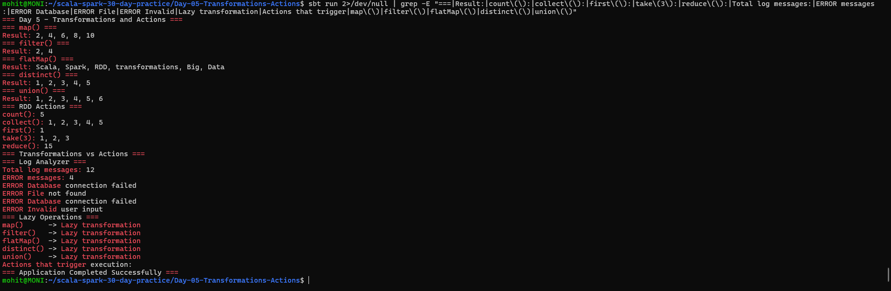

# Day 5 — Transformations and Actions

## Objective

Practice Apache Spark RDD transformations and actions using Scala. Understand lazy evaluation and build a simple log analyzer to count `ERROR` messages.

## Project Structure

```text
Day-05-Transformations-Actions/
├── build.sbt
├── data/
│   └── logs.txt
├── screenshots/
│   └── final_output.png
└── src/
    └── main/
        └── scala/
            └── Main.scala
```

## Technologies Used

- Scala 2.12.18
- Apache Spark 3.5.6
- sbt
- Java 17

## RDD Transformations

The following transformations were practiced:

- `map()` — transforms each element
- `filter()` — selects elements based on a condition
- `flatMap()` — transforms and flattens elements
- `distinct()` — removes duplicate elements
- `union()` — combines two RDDs

Transformations are **lazy**, meaning they do not execute immediately. They create a new RDD and are executed when an action is called.

## RDD Actions

The following actions were practiced:

- `count()` — returns the number of elements
- `collect()` — returns all elements
- `first()` — returns the first element
- `take()` — returns the specified number of elements
- `reduce()` — combines elements using a function

Actions trigger the execution of the RDD computation.

## Log Analyzer

A log file was processed using Spark RDDs.

The program:

1. Reads `data/logs.txt`
2. Filters messages starting with `ERROR`
3. Counts the error messages
4. Displays the error log entries

### Result

```text
Total log messages: 12
ERROR messages: 4
```

## Lazy Operations

The following are lazy transformations:

```text
map()
filter()
flatMap()
distinct()
union()
```

The following actions trigger execution:

```text
count()
collect()
first()
take()
reduce()
```

## How to Run

From the project directory:

```bash
sbt run
```

## Output

The program successfully demonstrates all required transformations, actions, lazy evaluation, and the log analyzer scenario.



## Conclusion

Day 5 successfully demonstrates Spark RDD transformations, actions, lazy evaluation, and a simple ERROR log analyzer using Scala and Apache Spark.