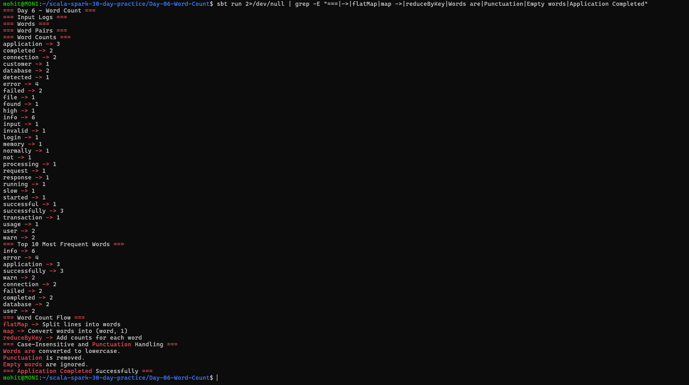

# Day 6 — Word Count

## Objective

Implement classic Word Count using Apache Spark RDDs with Scala. Practice the `flatMap`, `map`, and `reduceByKey` transformations, handle words case-insensitively, ignore punctuation and empty words, and find the top 10 most frequent words in application logs.

## Project Structure

```text
Day-06-Word-Count/
├── build.sbt
├── data/
│   └── logs.txt
├── project/
│   └── build.properties
├── screenshots/
│   └── final_output.png
└── src/
    └── main/
        └── scala/
            └── Main.scala
```

## Technologies Used

- Scala 2.12.18
- Apache Spark 3.5.6
- sbt 2.0.7
- Java 17

## Word Count Flow

The classic Word Count process follows:

```text
flatMap → map → reduceByKey
```

### flatMap

`flatMap` splits each log line into individual words.

```scala
val wordsRDD = linesRDD.flatMap { line =>
  line
    .replaceAll("[^a-zA-Z0-9\\s]", "")
    .toLowerCase
    .split("\\s+")
    .filter(_.nonEmpty)
}
```

### map

`map` converts every word into a key-value pair:

```text
(word, 1)
```

Example:

```text
info → (info, 1)
error → (error, 1)
```

### reduceByKey

`reduceByKey` combines values belonging to the same word:

```scala
val wordCountsRDD = wordPairsRDD.reduceByKey(_ + _)
```

For example:

```text
(info, 1)
(info, 1)
(info, 1)
```

becomes:

```text
info → 3
```

## Case-Insensitive Word Count

All words are converted to lowercase using:

```scala
.toLowerCase
```

Therefore, words such as:

```text
INFO
Info
info
```

are treated as the same word.

## Punctuation and Empty Words

Punctuation is removed using:

```scala
.replaceAll("[^a-zA-Z0-9\\s]", "")
```

Empty words are ignored using:

```scala
.filter(_.nonEmpty)
```

## Top 10 Most Frequent Words

The word counts are converted to:

```text
(count, word)
```

and sorted in descending order using `sortByKey`.

```scala
val top10Words = wordCountsRDD
  .map { case (word, count) => (count, word) }
  .sortByKey(ascending = false)
  .take(10)
```

### Result

```text
info -> 6
error -> 4
application -> 3
successfully -> 3
warn -> 2
connection -> 2
failed -> 2
completed -> 2
database -> 2
user -> 2
```

## Application Log Scenario

The program processes an application log file containing `INFO`, `ERROR`, and `WARN` messages.

The program:

1. Reads the application log file.
2. Splits log lines into individual words.
3. Converts words to lowercase.
4. Removes punctuation.
5. Ignores empty words.
6. Creates `(word, 1)` pairs.
7. Uses `reduceByKey` to calculate word frequencies.
8. Finds the top 10 most frequent words.

## How to Run

From the project directory:

```bash
sbt run
```

## Output

The program successfully demonstrates the classic Word Count process, case-insensitive counting, punctuation handling, and top 10 word frequency analysis.



## Conclusion

Day 6 successfully demonstrates Spark RDD Word Count using `flatMap`, `map`, and `reduceByKey`. The application also handles case-insensitive words, removes punctuation and empty words, and identifies the top 10 most frequent words from application logs.