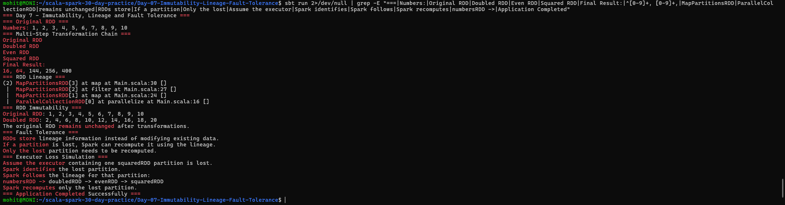

# Day 7 — Immutability, Lineage and Fault Tolerance

## Objective

Understand RDD immutability, lineage, and fault tolerance in Apache Spark using Scala.

The application demonstrates:

- A multi-step RDD transformation chain
- RDD lineage
- RDD immutability
- Lost partition recomputation
- Conceptual executor loss simulation

## Project Structure

```text
Day-07-Immutability-Lineage-Fault-Tolerance/
├── build.sbt
├── screenshots/
│   └── final_output.png
├── project/
│   └── build.properties
└── src/
    └── main/
        └── scala/
            └── Main.scala
```

## Technologies Used

- Scala 2.12.18
- Apache Spark 3.5.6
- sbt 2.0.7
- Java 17

## Multi-Step RDD Transformation Chain

The application creates the following transformation chain:

```text
numbersRDD
     ↓ map(_ * 2)
doubledRDD
     ↓ filter(_ % 4 == 0)
evenRDD
     ↓ map(n => n * n)
squaredRDD
```

The original RDD contains:

```text
1, 2, 3, 4, 5, 6, 7, 8, 9, 10
```

After doubling:

```text
2, 4, 6, 8, 10, 12, 14, 16, 18, 20
```

After filtering values divisible by 4:

```text
4, 8, 12, 16, 20
```

After squaring:

```text
16, 64, 144, 256, 400
```

## RDD Lineage

RDD lineage records how an RDD was created from its parent RDDs.

The application displays the lineage using:

```scala
squaredRDD.toDebugString
```

The lineage is:

```text
ParallelCollectionRDD
       ↓
     map
       ↓
    filter
       ↓
     map
       ↓
 squaredRDD
```

Spark uses this lineage information to reconstruct lost data when required.

## RDD Immutability

RDDs are immutable.

This means an existing RDD cannot be changed after it has been created.

For example:

```scala
val doubledRDD = numbersRDD.map(_ * 2)
```

The `map()` operation does not modify `numbersRDD`.

Instead, it creates a new RDD called `doubledRDD`.

The application demonstrates this by showing:

```text
Original RDD: 1, 2, 3, 4, 5, 6, 7, 8, 9, 10

Doubled RDD: 2, 4, 6, 8, 10, 12, 14, 16, 18, 20
```

The original RDD remains unchanged.

## Fault Tolerance

RDDs use lineage information for fault tolerance.

If a partition is lost, Spark can use the lineage to recompute that partition instead of requiring the entire dataset to be recreated.

The application demonstrates:

```text
If a partition is lost, Spark can recompute it using the lineage.
Only the lost partition needs to be recomputed.
```

## Executor Loss Simulation

The application conceptually simulates the loss of an executor containing one `squaredRDD` partition.

The recovery process is:

```text
Executor loss
     ↓
Lost partition identified
     ↓
Spark follows lineage
     ↓
numbersRDD
     ↓
doubledRDD
     ↓
evenRDD
     ↓
squaredRDD
     ↓
Lost partition recomputed
```

Only the lost partition needs to be recomputed.

## Important Concepts

### Immutability

An RDD cannot be modified after creation. Transformations create new RDDs.

### Lineage

Lineage is the record of transformations used to create an RDD.

### Fault Tolerance

Spark can recover lost RDD partitions by recomputing them from their lineage.

### Partition

An RDD is divided into partitions. Spark processes these partitions in parallel.

## How to Run

From the project directory:

```bash
sbt run
```

## Output

The application successfully demonstrates:

- Multi-step RDD transformations
- RDD lineage
- RDD immutability
- Fault tolerance
- Lost partition recomputation
- Conceptual executor loss



## Conclusion

Day 7 successfully demonstrates how Spark RDDs use immutability and lineage to provide fault tolerance. When a partition is lost, Spark can recompute the required partition by following the RDD lineage.