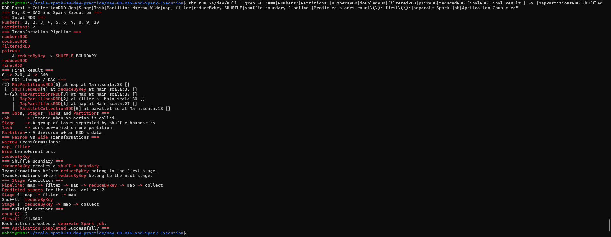

# Day 8 — DAG and Spark Execution

## Objective

Understand how Apache Spark executes RDD operations using DAGs, jobs, stages, tasks, partitions, and shuffle boundaries.

The application demonstrates:

- A multi-step Spark transformation pipeline
- DAG and RDD lineage
- Narrow and wide transformations
- Shuffle boundaries
- Jobs, stages, tasks, and partitions
- Stage prediction for a `reduceByKey` pipeline
- Multiple Spark actions

## Project Structure

```text
Day-08-DAG-and-Spark-Execution/
├── build.sbt
├── project/
│   └── build.properties
├── screenshots/
│   └── final_output.png
└── src/
    └── main/
        └── scala/
            └── Main.scala
```

## Technologies Used

- Scala 2.12.18
- Apache Spark 3.5.6
- sbt 2.0.7
- Java 17

## Transformation Pipeline

The application uses the following pipeline:

```text
numbersRDD
    ↓ map
doubledRDD
    ↓ filter
filteredRDD
    ↓ map to (key, value)
pairRDD
    ↓ reduceByKey
    ↓ SHUFFLE BOUNDARY
reducedRDD
    ↓ map
finalRDD
```

The input contains:

```text
1, 2, 3, 4, 5, 6, 7, 8, 9, 10
```

The final result is:

```text
0 -> 240
4 -> 360
```

## DAG and Lineage

The RDD lineage can be inspected using:

```scala
finalRDD.toDebugString
```

The resulting DAG contains:

```text
ParallelCollectionRDD
        ↓
      map
        ↓
     filter
        ↓
      map
        ↓
   ShuffledRDD
        ↓
      map
```

`ShuffledRDD` represents the shuffle caused by `reduceByKey`.

## Jobs, Stages, Tasks and Partitions

### Job

A Spark job is created when an action is called.

Examples:

```text
collect()
count()
first()
```

### Stage

A stage is a group of tasks separated by shuffle boundaries.

### Task

A task is the unit of work performed on one partition.

### Partition

A partition is a division of an RDD's data that Spark processes in parallel.

The input RDD in this application contains:

```text
Partitions: 2
```

## Narrow Transformations

Narrow transformations do not require data to be shuffled across partitions.

Examples used in this application:

```text
map
filter
```

Each output partition depends on a small number of input partitions.

## Wide Transformation

A wide transformation requires data to be shuffled across partitions.

The application uses:

```text
reduceByKey
```

`reduceByKey` is a wide transformation because values with the same key may need to move between partitions.

## Shuffle Boundary

The pipeline contains one shuffle boundary:

```text
map → filter → map
              ↓
        reduceByKey
              ↓
           SHUFFLE
              ↓
        reduceByKey → map
```

The shuffle separates the computation into stages.

## Stage Prediction

The pipeline is:

```text
map → filter → map → reduceByKey → map → collect
```

For the final `collect()` action, the predicted number of stages is:

```text
2
```

### Stage 0

```text
map → filter → map
```

### Shuffle Boundary

```text
reduceByKey
```

### Stage 1

```text
reduceByKey → map → collect
```

Therefore:

```text
Predicted stages: 2
```

## Multiple Actions

The application performs multiple actions:

```scala
finalRDD.count()
finalRDD.first()
```

Each action creates a separate Spark job.

The output demonstrates:

```text
count(): 2
first(): (4,360)
```

## How to Run

From the project directory:

```bash
sbt run
```

## Output

The application successfully demonstrates Spark DAG execution, shuffle boundaries, stages, tasks, partitions, narrow and wide transformations, and multiple jobs.



## Conclusion

Day 8 successfully demonstrates how Spark builds and executes a DAG. Narrow transformations can be combined within a stage, while a wide transformation such as `reduceByKey` creates a shuffle boundary and separates stages.