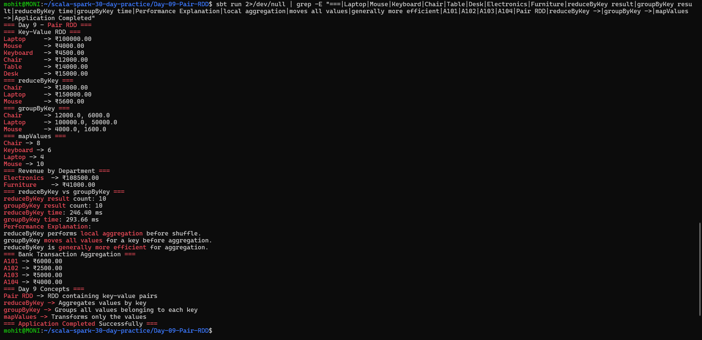

# Day 9 — Pair RDD

## Objective

Practice Pair RDD operations in Apache Spark using Scala.

The application demonstrates:

- Creating key-value RDDs
- `reduceByKey`
- `groupByKey`
- `mapValues`
- Revenue calculation by product and department
- Performance comparison between `reduceByKey` and `groupByKey`
- Bank transaction aggregation by account ID

## Project Structure

```text
Day-09-Pair-RDD/
├── build.sbt
├── project/
│   └── build.properties
├── screenshots/
│   └── final_output.png
└── src/
    └── main/
        └── scala/
            └── Main.scala
```

## Technologies Used

- Scala 2.12.18
- Apache Spark 3.5.6
- sbt 2.0.7
- Java 17

## Key-Value RDD

A Pair RDD contains data in key-value form.

Example:

```text
("Laptop", 100000.0)
("Mouse", 4000.0)
```

The application creates product revenue pairs from sales records.

## reduceByKey

`reduceByKey` combines values belonging to the same key.

Example:

```text
Laptop -> 100000
Laptop -> 50000
```

becomes:

```text
Laptop -> 150000
```

The application uses:

```scala
val reducedProductRevenue = productSales
  .reduceByKey(_ + _)
```

### Result

```text
Chair  -> ₹18000.00
Laptop -> ₹150000.00
Mouse  -> ₹5600.00
```

## groupByKey

`groupByKey` groups all values belonging to the same key.

Example:

```text
Laptop -> 100000
Laptop -> 50000
```

becomes:

```text
Laptop -> 100000.0, 50000.0
```

The application demonstrates this using:

```scala
val groupedProductSales = productSales
  .groupByKey()
```

## mapValues

`mapValues` transforms only the values of a Pair RDD while keeping the keys unchanged.

Example:

```text
Laptop -> 2
```

after doubling the value:

```text
Laptop -> 4
```

The application uses:

```scala
val doubledQuantities = productQuantities
  .mapValues(quantity => quantity * 2)
```

## Revenue by Product

The application calculates revenue using:

```text
quantity × price
```

The product revenue results include:

```text
Laptop  -> ₹100000.00
Mouse   -> ₹4000.00
Keyboard -> ₹4500.00
Chair   -> ₹12000.00
Table   -> ₹14000.00
Desk    -> ₹15000.00
```

## Revenue by Department

Revenue is aggregated using `reduceByKey` by department.

### Result

```text
Electronics -> ₹108500.00
Furniture   -> ₹41000.00
```

## reduceByKey vs groupByKey Performance

The application compares the execution time of both operations using a larger RDD.

Example output:

```text
reduceByKey result count: 10
groupByKey result count: 10
reduceByKey time: <measured time> ms
groupByKey time: <measured time> ms
```

The exact execution time can vary between runs depending on the system.

### Performance Explanation

`reduceByKey` performs local aggregation before the shuffle.

`groupByKey` moves all values for a key before aggregation.

Therefore, `reduceByKey` is generally more efficient for aggregation because it can reduce the amount of data transferred during the shuffle.

## Bank Transaction Aggregation

The application simulates bank transactions using:

```text
(accountId, transactionAmount)
```

Transactions can contain both deposits and withdrawals.

`reduceByKey` is used to calculate the net balance for each account.

### Result

```text
A101 -> ₹6000.00
A102 -> ₹2500.00
A103 -> ₹5000.00
A104 -> ₹4000.00
```

For example:

```text
A101:
5000 - 1000 + 2000
= 6000
```

## Important Concepts

### Pair RDD

An RDD containing key-value pairs.

### reduceByKey

Aggregates values belonging to the same key.

### groupByKey

Groups all values belonging to the same key.

### mapValues

Transforms only the values while preserving the keys.

### Preferred Aggregation

For aggregation operations, `reduceByKey` is generally preferred over `groupByKey` because it can perform local aggregation before the shuffle.

## How to Run

From the project directory:

```bash
sbt run
```

## Output

The application successfully demonstrates Pair RDD operations, revenue aggregation, performance comparison, and bank transaction aggregation.



## Conclusion

Day 9 successfully demonstrates Pair RDD operations using `reduceByKey`, `groupByKey`, and `mapValues`. The application also calculates revenue by product and department, compares aggregation performance, and aggregates bank transactions by account ID.