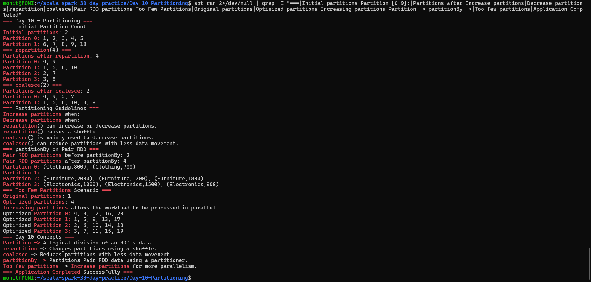

# Day 10 — Partitioning

## Objective

Practice partitioning concepts in Apache Spark using Scala.

The application demonstrates:

- Inspecting partition counts
- Using `repartition`
- Using `coalesce`
- Understanding when increasing or decreasing partitions helps
- Using `partitionBy` on a Pair RDD
- Optimizing a dataset suffering from too few partitions

## Project Structure

```text
Day-10-Partitioning/
├── build.sbt
├── project/
│   └── build.properties
├── screenshots/
│   └── final_output.png
└── src/
    └── main/
        └── scala/
            └── Main.scala
```

## Technologies Used

- Scala 2.12.18
- Apache Spark 3.5.6
- sbt 2.0.7
- Java 17

## Inspecting Partition Counts

The application starts with an RDD containing 10 numbers and 2 partitions.

```text
Initial partitions: 2

Partition 0: 1, 2, 3, 4, 5
Partition 1: 6, 7, 8, 9, 10
```

The partition contents are inspected using `mapPartitionsWithIndex`.

## repartition

`repartition` changes the number of partitions using a shuffle.

The application changes the initial RDD from 2 partitions to 4:

```text
Initial partitions: 2
Partitions after repartition: 4
```

The data is distributed across the new partitions.

### Important Point

`repartition()` can increase or decrease the number of partitions, but it causes a shuffle and therefore involves data movement.

## coalesce

`coalesce` is mainly used to decrease the number of partitions.

The application reduces the RDD from 4 partitions to 2:

```text
Partitions after repartition: 4
Partitions after coalesce: 2
```

`coalesce()` can reduce partitions with less data movement than a full `repartition()`.

## When to Increase Partitions

Increasing partitions can help when:

- The dataset has too few partitions.
- Tasks are processing too much data.
- More parallelism is needed.
- Cluster resources are not fully utilized.

More partitions can allow Spark to process more tasks in parallel, provided sufficient cluster resources are available.

## When to Decrease Partitions

Decreasing partitions can help when:

- The dataset has too many small partitions.
- Task scheduling overhead is high.
- The workload does not need high parallelism.

Too many tiny partitions can create unnecessary task scheduling overhead.

## partitionBy on Pair RDD

The application creates a Pair RDD containing department and sales values:

```text
("Electronics", 1000)
("Furniture", 2000)
("Clothing", 800)
```

The Pair RDD initially has 2 partitions.

A `HashPartitioner` is then used:

```scala
val partitionedSalesRDD = salesRDD.partitionBy(
  new HashPartitioner(4)
)
```

Result:

```text
Pair RDD partitions before partitionBy: 2
Pair RDD partitions after partitionBy: 4
```

`partitionBy` determines how key-value data is distributed across partitions using a partitioner.

## Too Few Partitions Scenario

The application simulates a dataset suffering from too few partitions.

The dataset initially contains 20 numbers in only one partition:

```text
Original partitions: 1
```

This means too much data is handled by a single partition.

The application optimizes the dataset by increasing the number of partitions:

```text
Optimized partitions: 4
```

The data is then distributed across four partitions:

```text
Optimized Partition 0: 4, 8, 12, 16, 20
Optimized Partition 1: 1, 5, 9, 13, 17
Optimized Partition 2: 2, 6, 10, 14, 18
Optimized Partition 3: 3, 7, 11, 15, 19
```

Increasing the number of partitions allows the workload to be processed in parallel instead of concentrating all the data in one partition.

## Partitioning Summary

| Operation | Purpose |
|---|---|
| `getNumPartitions` | Inspect the number of partitions |
| `repartition()` | Change partitions using a shuffle |
| `coalesce()` | Mainly reduce partitions with less data movement |
| `partitionBy()` | Partition Pair RDD data using a partitioner |

## Key Concepts

### Partition

A logical division of an RDD's data.

### repartition

Changes the number of partitions using a shuffle.

### coalesce

Reduces the number of partitions with less data movement.

### partitionBy

Partitions Pair RDD data using a partitioner.

### Too Few Partitions

When a dataset has too few partitions, increasing the number of partitions can provide more parallelism and better use of available resources.

## How to Run

From the project directory:

```bash
sbt run
```

## Output

The application successfully demonstrates partition counts, `repartition`, `coalesce`, `partitionBy`, and optimization of a dataset with too few partitions.



## Conclusion

Day 10 successfully demonstrates Spark partitioning concepts using `repartition`, `coalesce`, and `partitionBy`. The application also shows how increasing partitions can optimize a dataset suffering from too few partitions.