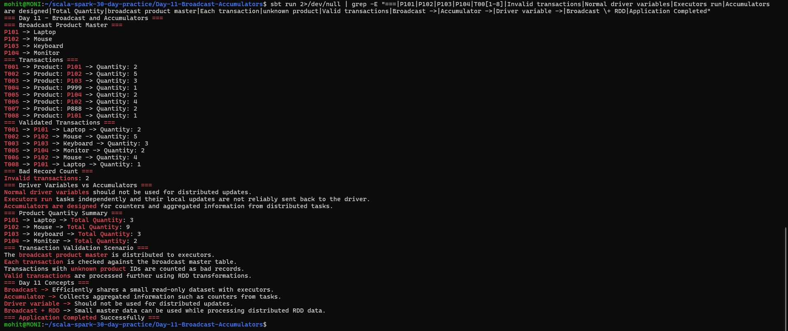

# Day 11 — Broadcast and Accumulators

## Objective

Practice Broadcast Variables and Accumulators in Apache Spark using Scala.

The application demonstrates:

- Broadcasting a small product reference map
- Using an accumulator to count bad records
- Understanding why normal driver variables should not be used for distributed updates
- Combining broadcast data with RDD processing
- Validating transactions against a small master table

## Project Structure

```text
Day-11-Broadcast-Accumulators/
├── build.sbt
├── project/
│   └── build.properties
├── screenshots/
│   └── final_output.png
└── src/
    └── main/
        └── scala/
            └── Main.scala
```

## Technologies Used

- Scala 2.12.18
- Apache Spark 3.5.6
- sbt 2.0.7
- Java 17

## Broadcast Variable

A Broadcast Variable efficiently shares a small, read-only dataset with executors.

The application creates a small product master:

```text
P101 -> Laptop
P102 -> Mouse
P103 -> Keyboard
P104 -> Monitor
```

It is broadcast using:

```scala
val broadcastProducts = sc.broadcast(productMaster)
```

Executors can then access the product master through:

```scala
broadcastProducts.value
```

Broadcasting is useful when the same small reference dataset is required by many distributed tasks.

## Transaction Data

The application processes transaction records containing:

```text
Transaction ID
Product ID
Quantity
```

Example:

```text
T001 -> Product: P101 -> Quantity: 2
T002 -> Product: P102 -> Quantity: 5
T004 -> Product: P999 -> Quantity: 1
```

Some transactions contain product IDs that do not exist in the master table.

## Transaction Validation

Each transaction is checked against the broadcast product master.

If the product ID exists, the transaction is considered valid.

If the product ID does not exist, it is counted as a bad record.

### Validated Transactions

The application successfully validates transactions such as:

```text
T001 -> P101 -> Laptop -> Quantity: 2
T002 -> P102 -> Mouse -> Quantity: 5
T003 -> P103 -> Keyboard -> Quantity: 3
T005 -> P104 -> Monitor -> Quantity: 2
T006 -> P102 -> Mouse -> Quantity: 4
T008 -> P101 -> Laptop -> Quantity: 1
```

## Accumulator

An Accumulator is used to count invalid transactions.

The application creates a Long Accumulator:

```scala
val badRecordAccumulator = sc.longAccumulator("Bad Records")
```

When an unknown product ID is found:

```scala
badRecordAccumulator.add(1)
```

### Result

```text
Invalid transactions: 2
```

The two invalid transactions contain unknown product IDs:

```text
P999
P888
```

## Driver Variables vs Accumulators

Normal driver variables should not be used for distributed updates.

Spark tasks execute independently on executors. A normal variable on the driver is not a reliable mechanism for collecting updates from distributed tasks.

Accumulators are designed for aggregated information such as counters.

In this application, the accumulator is used to count invalid transactions across distributed processing.

## Broadcast + RDD Processing

The application combines the broadcast product master with RDD processing.

The flow is:

```text
Product Master
      |
      v
Broadcast Variable
      |
      v
Transaction RDD
      |
      v
Validate Product IDs
      |
      +------------------+
      |                  |
      v                  v
Valid Transactions    Bad Records
      |                  |
      v                  v
Further RDD          Accumulator
Processing           Count
```

## Product Quantity Summary

After validation, the valid transactions are aggregated to calculate total quantity by product.

### Result

```text
P101 -> Laptop -> Total Quantity: 3
P102 -> Mouse -> Total Quantity: 9
P103 -> Keyboard -> Total Quantity: 3
P104 -> Monitor -> Total Quantity: 2
```

## Transaction Validation Scenario

The scenario represents a common distributed-data-processing use case:

1. A small master table contains product reference information.
2. The master table is broadcast to executors.
3. A transaction RDD is processed in parallel.
4. Each transaction is checked against the broadcast master.
5. Unknown product IDs are counted as bad records.
6. Valid transactions are processed further using RDD transformations.

## Key Concepts

### Broadcast

Efficiently shares a small read-only dataset with executors.

### Accumulator

Collects aggregated information such as counters from distributed tasks.

### Driver Variable

A normal driver variable should not be used for distributed updates.

### Broadcast + RDD

Small master data can be broadcast and used while processing distributed RDD data.

## How to Run

From the project directory:

```bash
sbt run
```

## Output

The application successfully demonstrates broadcast variables, accumulators, transaction validation, and RDD processing.



## Conclusion

Day 11 successfully demonstrates how Broadcast Variables can distribute small reference data to executors and how Accumulators can collect information such as bad-record counts during distributed processing.