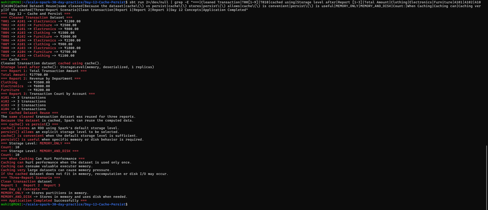

# Day 12 — Cache and Persist

## Objective

Practice caching and persistence techniques in Apache Spark using Scala.

The application demonstrates:

- Caching a cleaned RDD
- Reusing a cached RDD across multiple actions
- Comparing `cache()` and `persist()`
- Experimenting with different storage levels
- Understanding when caching can hurt performance
- Reusing a cleaned transaction dataset for three reports

## Project Structure

```text
Day-12-Cache-Persist/
├── build.sbt
├── project/
│   └── build.properties
├── screenshots/
│   └── final_output.png
└── src/
    └── main/
        └── scala/
            └── Main.scala
```

## Technologies Used

- Scala 2.12.18
- Apache Spark 3.5.6
- sbt 2.0.7
- Java 17

## Cleaned Transaction Dataset

The application creates a transaction dataset containing:

```text
Transaction ID
Account ID
Department
Amount
```

The transactions are cleaned by filtering records with positive amounts.

Example:

```text
T001 -> A101 -> Electronics -> ₹1200.00
T002 -> A102 -> Furniture -> ₹2500.00
T003 -> A101 -> Electronics -> ₹800.00
```

## cache()

The cleaned transaction RDD is cached using:

```scala
cleanedTransactions.cache()
```

The storage level shown during execution is:

```text
StorageLevel(memory, deserialized, 1 replicas)
```

Caching allows Spark to keep the computed RDD so it can be reused by subsequent actions.

## Three Reports Using the Cached Dataset

The same cleaned transaction dataset is reused for three reports.

### Report 1 — Total Transaction Amount

The total transaction amount is:

```text
₹17700.00
```

### Report 2 — Revenue by Department

The application calculates revenue by department.

```text
Clothing     -> ₹3500.00
Electronics  -> ₹6000.00
Furniture    -> ₹8200.00
```

### Report 3 — Transaction Count by Account

The application calculates the number of transactions for each account.

```text
A101 -> 3 transactions
A102 -> 3 transactions
A103 -> 2 transactions
A104 -> 2 transactions
```

## Cached Dataset Reuse

The application demonstrates that the same cleaned transaction dataset is reused across all three reports.

```text
Clean transaction dataset
        ↓
      cache()
        ↓
  +-----+-----+-----+
  |           |     |
Report 1   Report 2  Report 3
Total      Department Account
Amount     Revenue   Count
```

Caching is useful when an RDD is expensive to compute and is reused by multiple actions.

## cache() vs persist()

### cache()

`cache()` stores an RDD using Spark's default storage level.

Example:

```scala
cleanedTransactions.cache()
```

It is convenient when the default storage level is sufficient.

### persist()

`persist()` allows an explicit storage level to be selected.

Example:

```scala
rdd.persist(StorageLevel.MEMORY_ONLY)
```

It is useful when specific memory or disk behavior is required.

### Comparison

| Operation | Purpose |
|---|---|
| `cache()` | Uses Spark's default storage level |
| `persist()` | Allows an explicit storage level |

## Storage Levels

The application experiments with two storage levels.

### MEMORY_ONLY

```scala
StorageLevel.MEMORY_ONLY
```

Stores RDD partitions in memory.

Execution result:

```text
Storage level: StorageLevel(memory, deserialized, 1 replicas)
Count: 10
```

### MEMORY_AND_DISK

```scala
StorageLevel.MEMORY_AND_DISK
```

Stores partitions in memory and uses disk when necessary.

Execution result:

```text
Storage level: StorageLevel(disk, memory, deserialized, 1 replicas)
Count: 10
```

## When Caching Can Hurt Performance

Caching is not always beneficial.

Caching can hurt performance when:

- The dataset is used only once.
- Valuable executor memory is consumed unnecessarily.
- Very large datasets create memory pressure.
- The cached dataset does not fit in memory.
- Disk I/O or recomputation becomes necessary.

Caching should generally be considered when a dataset is expensive to compute and will be reused multiple times.

## Three-Report Scenario

The application represents a common Spark use case:

1. Load and clean transaction data.
2. Cache the cleaned dataset.
3. Generate a total amount report.
4. Generate a department revenue report.
5. Generate an account transaction-count report.
6. Reuse the cached dataset for all three reports.

This avoids repeatedly recomputing the cleaned dataset when it is reused.

## Key Concepts

### cache()

Caches an RDD using Spark's default storage level.

### persist()

Caches an RDD using a selected storage level.

### MEMORY_ONLY

Stores partitions in memory.

### MEMORY_AND_DISK

Stores partitions in memory and uses disk when necessary.

### Caching

Useful for expensive datasets that are reused multiple times.

## How to Run

From the project directory:

```bash
sbt run
```

## Output

The application successfully demonstrates caching, persistence, storage levels, and reuse of a cleaned transaction dataset.



## Conclusion

Day 12 successfully demonstrates `cache()` and `persist()` in Spark. The application also compares storage levels and shows how a cached transaction dataset can be reused to generate multiple reports.