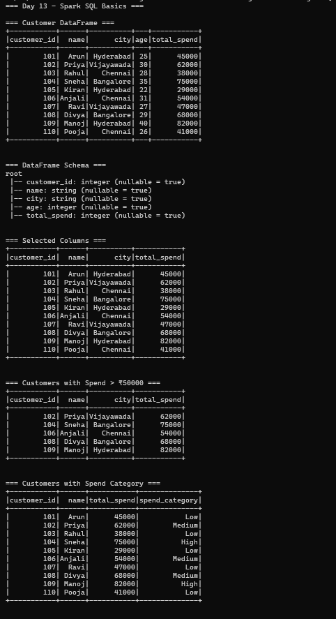
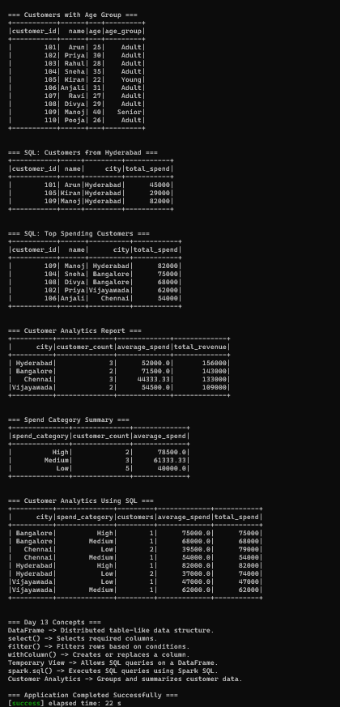

# Day 13 — Spark SQL Basics

## Objective

Practice Spark SQL basics using Scala and Apache Spark.

The application demonstrates:

- Creating a DataFrame from CSV data
- Inspecting the DataFrame schema
- Selecting and filtering columns
- Using withColumn() and expressions
- Registering and using a temporary view
- Running SQL queries using Spark SQL
- Building a customer analytics report using Spark SQL

## Project Structure

Day-13-Spark-SQL-Basics/
├── build.sbt
├── data/
│   └── customers.csv
├── project/
│   └── build.properties
├── screenshots/
│   ├── final_output1.png
│   └── final_output2.png
└── src/
    └── main/
        └── scala/
            └── Main.scala

## Technologies Used

- Scala 2.12.18
- Apache Spark 3.5.6
- Spark SQL
- sbt 2.0.7
- Java 17

## Customer Dataset

The application uses customer data stored in:

data/customers.csv

The dataset contains:

customer_id
name
city
age
total_spend

The application loads the CSV file into a Spark DataFrame.

## Creating a DataFrame from CSV

The customer CSV data is loaded using Spark's CSV reader:

val customersDF = spark.read
  .option("header", "true")
  .option("inferSchema", "true")
  .csv("data/customers.csv")

The application successfully loads 10 customer records.

## Inspecting Schema

The DataFrame schema is inspected using:

customersDF.printSchema()

The resulting schema contains:

customer_id: integer
name: string
city: string
age: integer
total_spend: integer

## Selecting Columns

Required columns are selected using select():

customersDF
  .select("customer_id", "name", "city", "total_spend")
  .show()

This displays the selected customer information.

## Filtering Customers

Customers whose total spending is greater than ₹50000 are filtered using:

customersDF
  .filter(col("total_spend") > 50000)

The application returns five customers whose spending is greater than ₹50000.

## withColumn() and Expressions

The application creates a new spend_category column using withColumn():

.withColumn(
  "spend_category",
  when(col("total_spend") >= 70000, "High")
    .when(col("total_spend") >= 50000, "Medium")
    .otherwise("Low")
)

The spending categories are:

High
Medium
Low

An age_group column is also created using:

.withColumn(
  "age_group",
  when(col("age") < 25, "Young")
    .when(col("age") <= 35, "Adult")
    .otherwise("Senior")
)

The age groups are:

Young
Adult
Senior

## Temporary View

The DataFrame is registered as a temporary SQL view:

customersWithAgeGroupDF.createOrReplaceTempView("customers")

The temporary view is named:

customers

This allows SQL queries to be executed against the DataFrame.

## Running SQL Queries

Spark SQL queries are executed using:

spark.sql()

### Customers from Hyderabad

The application retrieves customers from Hyderabad using:

SELECT customer_id, name, city, total_spend
FROM customers
WHERE city = 'Hyderabad'

The result contains:

101 -> Arun  -> Hyderabad -> ₹45000
105 -> Kiran -> Hyderabad -> ₹29000
109 -> Manoj -> Hyderabad -> ₹82000

### Top Spending Customers

The application retrieves the top five customers by spending:

SELECT customer_id, name, city, total_spend
FROM customers
ORDER BY total_spend DESC
LIMIT 5

The results are ordered by total spending in descending order.

## Customer Analytics Report

The main scenario for Day 13 is building a customer analytics report using Spark SQL.

The application calculates:

- Customer count
- Average spending
- Total revenue

The SQL operations used include:

COUNT()
AVG()
SUM()
GROUP BY
ORDER BY

## Customer Analytics by City

The customer analytics report produces the following results:

Hyderabad  -> 3 customers -> Average Spend: ₹52000.00 -> Total Revenue: ₹156000
Bangalore  -> 2 customers -> Average Spend: ₹71500.00 -> Total Revenue: ₹143000
Chennai    -> 3 customers -> Average Spend: ₹44333.33 -> Total Revenue: ₹133000
Vijayawada -> 2 customers -> Average Spend: ₹54500.00 -> Total Revenue: ₹109000

## Spend Category Summary

The application also groups customers according to their spending category.

High   -> 2 customers -> Average Spend: ₹78500.00
Medium -> 3 customers -> Average Spend: ₹61333.33
Low    -> 5 customers -> Average Spend: ₹40000.00

## Customer Analytics Using SQL

The application performs detailed analysis by grouping customers using:

city
spend_category

The report calculates:

- Number of customers
- Average spending
- Total spending

The SQL query uses:

SELECT
  city,
  spend_category,
  COUNT(*) AS customers,
  ROUND(AVG(total_spend), 2) AS average_spend,
  ROUND(SUM(total_spend), 2) AS total_spend
FROM customers
GROUP BY city, spend_category
ORDER BY city, spend_category

This demonstrates how Spark SQL can be used for multi-dimensional customer analytics.

## Customer Analytics Scenario

The complete workflow is:

Customer CSV Data
       ↓
Create DataFrame
       ↓
Inspect Schema
       ↓
Select and Filter Data
       ↓
Create Derived Columns
       ↓
Register Temporary View
       ↓
Run Spark SQL Queries
       ↓
Generate Customer Analytics
       ↓
Display Reports

## Key Concepts

### DataFrame

A distributed table-like data structure used for structured data processing.

### select()

Selects required columns from a DataFrame.

### filter()

Filters rows based on a condition.

### withColumn()

Creates or replaces a DataFrame column using an expression.

### Temporary View

Registers a DataFrame as a temporary SQL view so that SQL queries can be executed against it.

### spark.sql()

Executes SQL queries using Spark SQL.

### Customer Analytics

Uses SQL aggregation operations such as COUNT, AVG, SUM, and GROUP BY to generate customer reports.

## How to Run

From the project directory:

sbt run

## Output

The application successfully demonstrates:

- DataFrame creation from CSV
- Schema inspection
- Column selection
- Filtering
- withColumn() expressions
- Temporary SQL views
- Spark SQL queries
- Customer analytics

## Screenshots

### Screenshot 1

### Screenshot 2

## Conclusion

Day 13 successfully demonstrates Spark SQL basics using Scala. The application creates a DataFrame from CSV data, inspects and transforms the data, registers a temporary view, executes SQL queries, and generates customer analytics reports using Spark SQL.