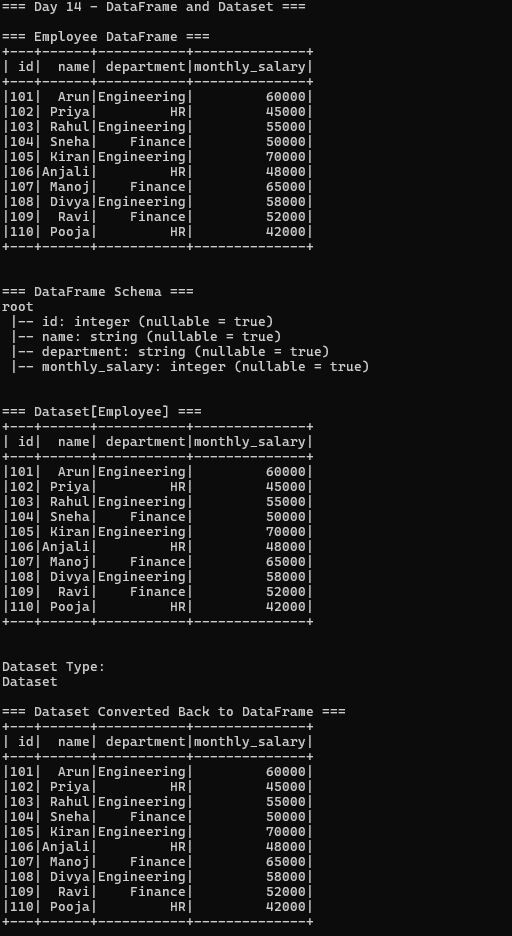
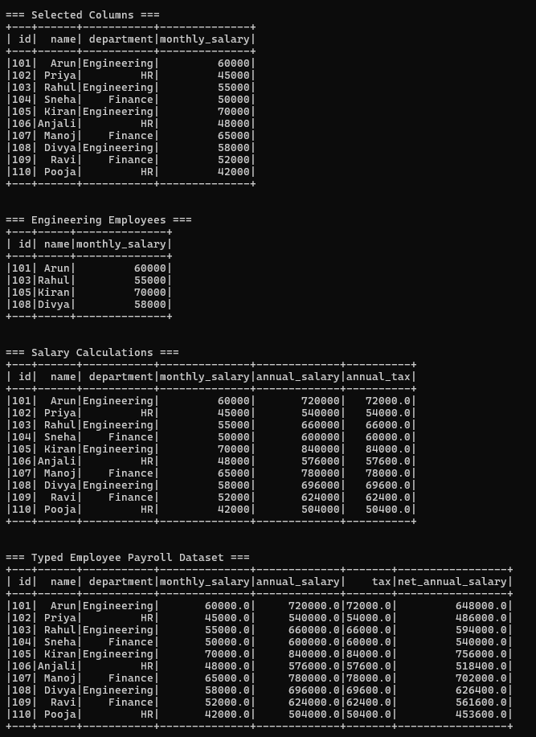
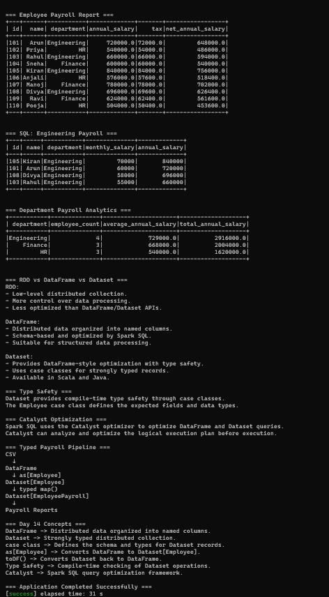

# Day 14 — DataFrame and Dataset

## Objective

Practice Spark DataFrame and Dataset APIs using Scala and build a typed employee payroll processing pipeline.

## Requirements

1. Create a case class and convert DataFrame → Dataset.
2. Convert Dataset → DataFrame.
3. Compare RDD, DataFrame, and Dataset.
4. Explain type safety and Catalyst optimization.
5. Build a typed employee payroll pipeline.

## Project Structure

Day-14-DataFrame-and-Dataset/
├── .gitignore
├── README.md
├── build.sbt
├── data/
│   └── employees.csv
├── project/
│   └── build.properties
├── screenshots/
│   ├── final_output1.png
│   ├── final_output2.png
│   └── final_output3.png
└── src/
    └── main/
        └── scala/
            └── Main.scala

## Technologies Used

- Scala 2.12.18
- Apache Spark 3.5.6
- Spark Core
- Spark SQL
- sbt 2.0.7
- Java 17
- WSL2 Ubuntu

## Dataset

The project uses `data/employees.csv`.

The dataset contains the following fields:

- `id`
- `name`
- `department`
- `monthly_salary`

The dataset contains 10 employee records from Engineering, HR, and Finance departments.

## 1. Create DataFrame from CSV

The employee CSV file is loaded into a Spark DataFrame using:

- CSV format
- Header enabled
- Schema inference enabled

The resulting DataFrame contains employee records organized into named columns.

## 2. Inspect DataFrame Schema

The `printSchema()` operation is used to inspect the structure and data types of the DataFrame.

The schema contains:

- `id` → Integer
- `name` → String
- `department` → String
- `monthly_salary` → Integer

## 3. Convert DataFrame to Dataset

A Scala case class named `Employee` is used to represent employee records.

The DataFrame is converted into a typed Dataset using:

`as[Employee]`

This creates:

`Dataset[Employee]`

The Dataset provides compile-time type safety through the `Employee` case class.

## 4. Convert Dataset to DataFrame

The typed Dataset is converted back into a DataFrame using:

`toDF()`

This demonstrates conversion between the DataFrame and Dataset APIs.

## 5. DataFrame Operations

The project demonstrates common DataFrame operations.

### select()

The `select()` operation is used to choose required columns from the employee DataFrame.

### filter()

The `filter()` operation is used to select employees based on conditions.

For example, Engineering employees are filtered using the department column.

### withColumn()

The `withColumn()` operation is used to create calculated columns.

The project calculates:

- Annual salary
- Annual tax

Annual salary:

`monthly_salary × 12`

Annual tax:

`annual_salary × 10%`

## 6. Typed Employee Payroll Pipeline

The typed Dataset is transformed using a `map()` operation.

The pipeline calculates:

- Monthly salary
- Annual salary
- Tax
- Net annual salary

A second case class named `EmployeePayroll` is used to represent the processed payroll records.

Pipeline:

CSV
↓
DataFrame
↓
Dataset[Employee]
↓
Typed map()
↓
Dataset[EmployeePayroll]
↓
Payroll Reports

## 7. Temporary View and Spark SQL

The employee DataFrame is registered as a temporary SQL view named:

`employees`

Spark SQL is then used with:

`spark.sql()`

The SQL query retrieves Engineering employees and calculates annual salary.

The results are ordered by annual salary in descending order.

## 8. Department Payroll Analytics

The payroll Dataset is grouped by department.

The report calculates:

- Employee count
- Average annual salary
- Total annual salary

### Department Results

Engineering:

- Employee count: 4
- Average annual salary: ₹729000
- Total annual salary: ₹2916000

Finance:

- Employee count: 3
- Average annual salary: ₹668000
- Total annual salary: ₹2004000

HR:

- Employee count: 3
- Average annual salary: ₹540000
- Total annual salary: ₹1620000

## 9. RDD vs DataFrame vs Dataset

### RDD

RDD is a low-level distributed collection.

Advantages:

- Provides low-level control over distributed data processing.
- Useful for unstructured or custom processing.

Disadvantage:

- Less optimized than DataFrame and Dataset APIs for structured data processing.

### DataFrame

A DataFrame is distributed data organized into named columns.

Features:

- Schema-based
- Suitable for structured data
- Optimized by Spark SQL
- Provides convenient SQL-style operations

### Dataset

A Dataset is a strongly typed distributed collection.

Features:

- Provides type safety
- Uses Scala case classes for typed records
- Provides DataFrame-style optimization
- Available in Scala and Java

## 10. Type Safety

Datasets provide compile-time type safety through case classes.

The `Employee` case class defines the expected fields and their data types.

For example:

- `id` → Int
- `name` → String
- `department` → String
- `monthly_salary` → Double

This allows Scala to check the structure of Dataset records during compilation.

## 11. Catalyst Optimization

Spark SQL uses the Catalyst optimizer to optimize DataFrame and Dataset queries.

Catalyst analyzes the logical execution plan and applies optimization before execution.

This allows Spark to improve how structured queries are executed.

## 12. Typed Payroll Architecture

The complete typed payroll pipeline is:

CSV
↓
DataFrame
↓
as[Employee]
↓
Dataset[Employee]
↓
typed map()
↓
Dataset[EmployeePayroll]
↓
Payroll Reports

## 13. Application Output

The application successfully demonstrates:

- Employee DataFrame creation
- DataFrame schema inspection
- DataFrame → Dataset conversion
- Dataset → DataFrame conversion
- Column selection
- Employee filtering
- Salary calculations using `withColumn()`
- Typed employee payroll processing
- Temporary SQL view
- Spark SQL queries
- Department payroll analytics
- RDD vs DataFrame vs Dataset comparison
- Type safety
- Catalyst optimization

## Screenshots

### Screenshot 1 — DataFrame and Dataset

### Screenshot 2 — Payroll and SQL

### Screenshot 3 — Analytics and Concepts

## Key Concepts Learned

- DataFrame
- Dataset
- Case Class
- `as[Employee]`
- `toDF()`
- `select()`
- `filter()`
- `withColumn()`
- Temporary Views
- `spark.sql()`
- Type Safety
- Catalyst Optimizer
- Typed Data Processing
- Payroll Analytics

## Conclusion

Day 14 demonstrates how Spark DataFrames and Datasets can be used for structured and typed data processing.

The project converts employee CSV data into a DataFrame, transforms it into a typed Dataset, performs payroll calculations, executes Spark SQL queries, and generates department-level analytics.

The typed employee payroll pipeline demonstrates the combination of Scala type safety with Spark's optimized structured-data processing.

## Application Status

Application completed successfully.