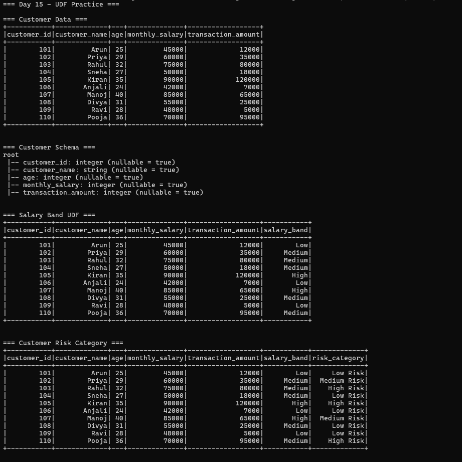
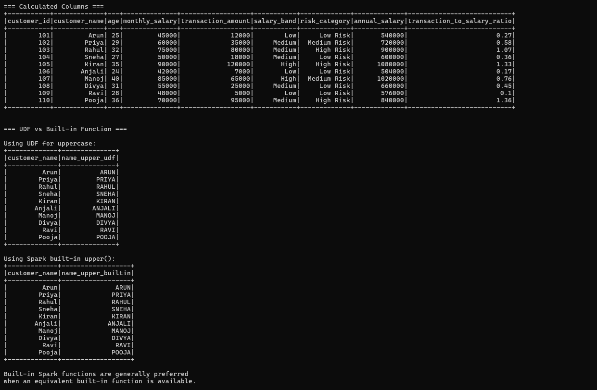
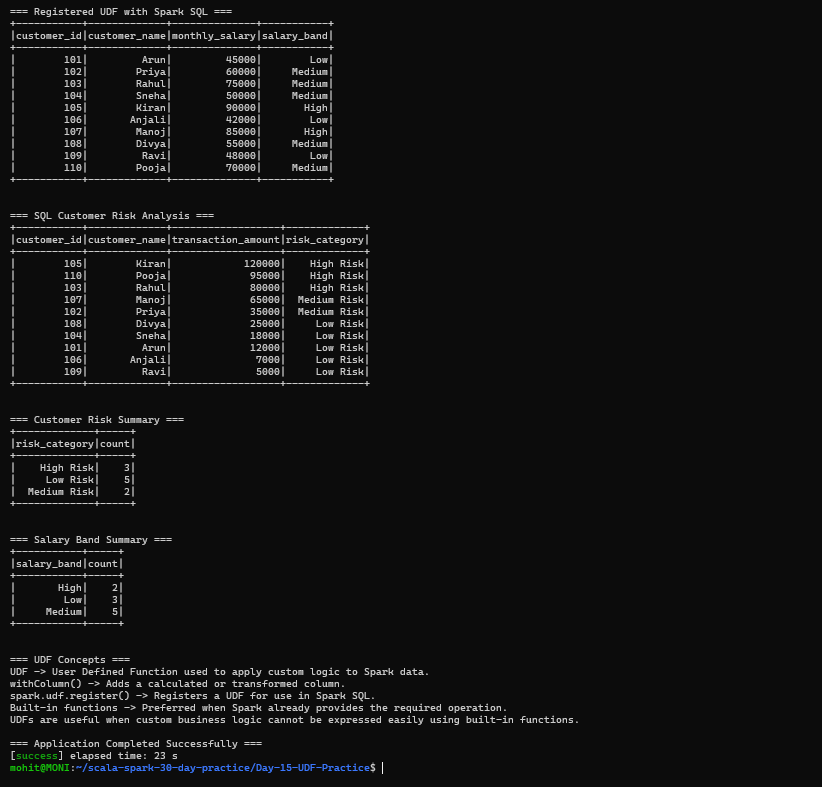

# Day 15 — UDF Practice

## Objective

Practice User Defined Functions (UDFs) in Apache Spark using Scala and apply custom business logic to salary and customer transaction data.

## Requirements

1. Create a Scala UDF to classify salary bands.
2. Add calculated columns with `withColumn()`.
3. Compare a UDF with a built-in Spark function.
4. Register a UDF with the Spark session/catalog.
5. Create a customer risk category from transaction values.

## Project Structure

Day-15-UDF-Practice/
├── .gitignore
├── README.md
├── build.sbt
├── data/
│   └── customers.csv
├── project/
│   └── build.properties
├── screenshots/
│   ├── final_output1.png
│   ├── final_output2.png
│   └── final_output3.png
└── src/
    └── main/
        └── scala/
            └── Main.scala

## Technologies Used

- Scala 2.12.18
- Apache Spark 3.5.6
- Spark SQL
- sbt 2.0.7
- Java 17
- WSL2 Ubuntu

## Dataset

The project uses `data/customers.csv`.

The dataset contains:

- Customer ID
- Customer name
- Age
- Monthly salary
- Transaction amount

The dataset contains 10 customer records.

## 1. Salary Band UDF

A Scala UDF named `salaryBandUDF` is created to classify customers according to their monthly salary.

Classification rules:

- Salary >= ₹80,000 → High
- Salary >= ₹50,000 → Medium
- Salary < ₹50,000 → Low

The UDF is applied using `withColumn()`.

Example:

`salaryBandUDF(col("monthly_salary"))`

This creates the new column:

`salary_band`

### Salary Band Results

- High → 2 customers
- Medium → 5 customers
- Low → 3 customers

## 2. Customer Risk Category UDF

A second UDF named `riskCategoryUDF` is used to classify customers based on transaction amount.

Classification rules:

- Transaction amount >= ₹80,000 → High Risk
- Transaction amount >= ₹30,000 → Medium Risk
- Transaction amount < ₹30,000 → Low Risk

The result is stored in:

`risk_category`

### Customer Risk Results

- High Risk → 3 customers
- Medium Risk → 2 customers
- Low Risk → 5 customers

## 3. Calculated Columns with withColumn()

The project uses `withColumn()` to create additional calculated columns.

### Annual Salary

Annual salary is calculated as:

`monthly_salary × 12`

### Transaction-to-Salary Ratio

The transaction-to-salary ratio is calculated as:

`transaction_amount / monthly_salary`

The result is rounded to two decimal places.

These calculations demonstrate how `withColumn()` can be used to add derived information to a DataFrame.

## 4. UDF vs Built-in Spark Function

The project compares a custom UDF with the Spark built-in `upper()` function.

### Using UDF

A custom UDF converts customer names to uppercase.

### Using Spark Built-in Function

Spark's built-in `upper()` function performs the same operation.

Both produce the same uppercase results.

Built-in Spark functions are generally preferred when an equivalent function is already available because Spark can optimize built-in operations more effectively.

UDFs are useful when custom business logic cannot be easily expressed using existing Spark functions.

## 5. Register UDF with Spark SQL

The salary classification function is registered with Spark SQL using:

`spark.udf.register()`

The registered function is:

`salary_band`

A temporary view named `customers` is created from the DataFrame.

The registered UDF can then be called inside a Spark SQL query.

Example:

`salary_band(monthly_salary)`

This demonstrates how Scala UDF logic can be made available through the Spark SQL session/catalog.

## 6. SQL Customer Risk Analysis

A `risk_category` UDF is also registered with Spark SQL.

The SQL query calculates the risk category from transaction amounts.

The customers are ordered by transaction amount in descending order.

The highest transaction amounts are classified as High Risk.

## 7. Customer Risk Summary

The risk categories are grouped and counted.

Results:

- High Risk → 3
- Medium Risk → 2
- Low Risk → 5

This demonstrates how UDF-generated columns can be used for further Spark DataFrame analytics.

## 8. Salary Band Summary

The salary bands are grouped and counted.

Results:

- High → 2
- Medium → 5
- Low → 3

## 9. UDF Concepts

### UDF

A User Defined Function allows custom logic to be applied to Spark data.

### withColumn()

`withColumn()` adds a new calculated or transformed column to a DataFrame.

### spark.udf.register()

`spark.udf.register()` registers a UDF so that it can be used in Spark SQL queries.

### Built-in Functions

Spark provides many built-in functions for common data transformations.

When a suitable built-in function exists, it is generally preferred over creating a custom UDF.

### When UDFs Are Useful

UDFs are useful when custom business rules cannot be easily implemented using Spark's existing built-in functions.

## 10. Customer Risk Processing Pipeline

The complete processing flow is:

CSV
↓
Customer DataFrame
↓
Salary Band UDF
↓
Customer Risk UDF
↓
withColumn()
↓
Calculated Columns
↓
Spark SQL UDF Registration
↓
Customer Risk Analysis
↓
Risk and Salary Summaries

## 11. Application Output

The application successfully demonstrates:

- Customer data loading
- Schema inspection
- Salary band classification
- Customer risk classification
- `withColumn()` calculations
- UDF vs built-in function comparison
- UDF registration with Spark SQL
- SQL customer risk analysis
- Customer risk summary
- Salary band summary
- UDF concepts

## Screenshots

### Screenshot 1 — Customer Data and UDF Classification

### Screenshot 2 — Calculated Columns and UDF Comparison

### Screenshot 3 — SQL Registration and Risk Analysis

## Key Concepts Learned

- User Defined Functions
- Scala UDF
- `udf()`
- `withColumn()`
- Spark built-in functions
- `spark.udf.register()`
- Spark SQL
- Customer risk classification
- Salary band classification
- DataFrame transformations
- Custom business logic

## Conclusion

Day 15 demonstrates how Scala UDFs can be used with Spark DataFrames and Spark SQL to implement custom business rules.

The project classifies salary bands, creates customer risk categories from transaction values, adds calculated columns, compares custom UDF logic with a Spark built-in function, and registers UDFs for use in Spark SQL.

The customer risk scenario demonstrates how UDFs can be applied to real-world style transaction analysis.

## Application Status

Application completed successfully.