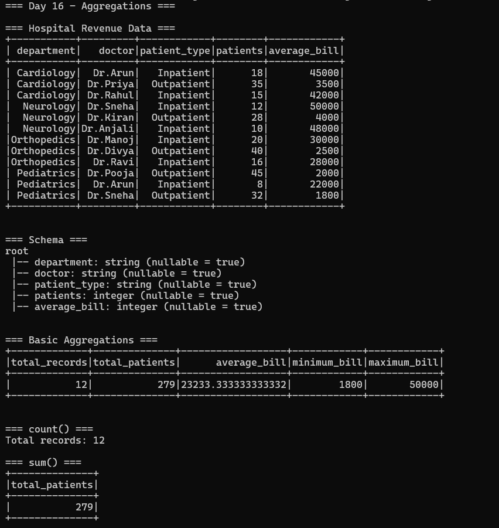
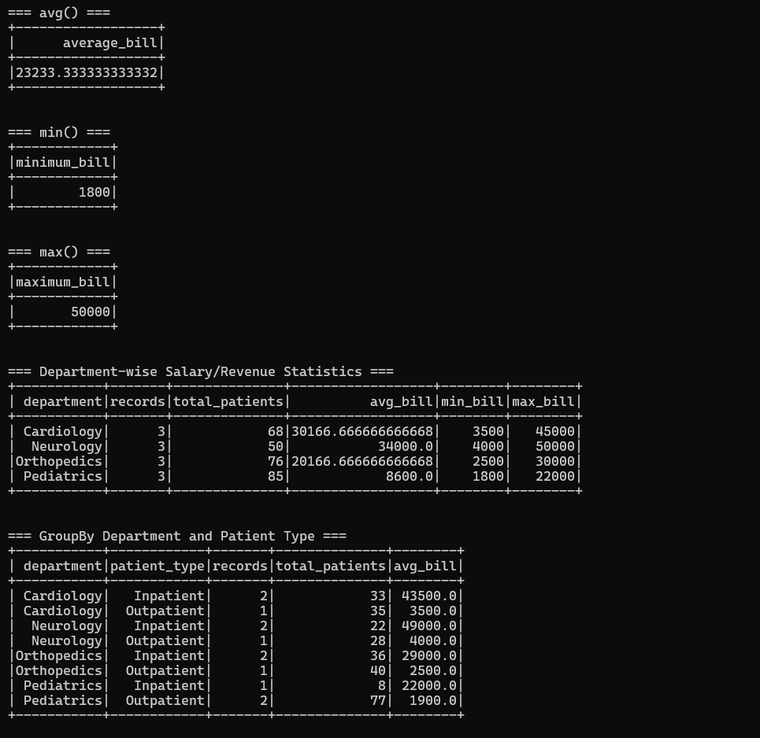
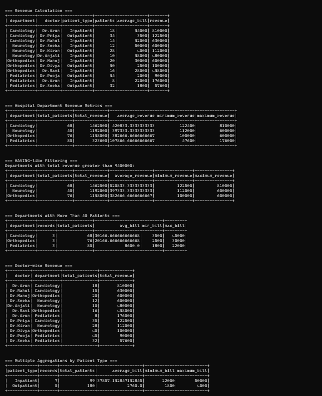
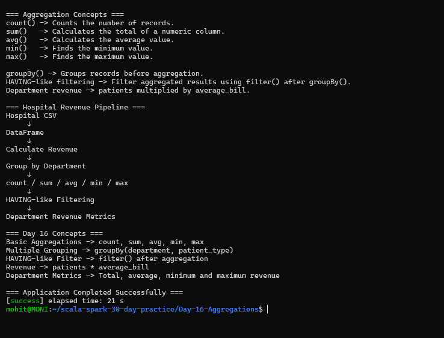

# Day 16 — Aggregations

## Objective

Practice Spark aggregation functions and grouped analytics using a hospital revenue dataset.

## Requirements

1. Practice `count`, `sum`, `avg`, `min`, and `max`.
2. Use `groupBy` with multiple columns.
3. Use HAVING-like filtering after aggregation.
4. Calculate department-wise salary statistics.
5. Generate hospital department revenue metrics.

## Project Structure

Day-16-Aggregations/
├── .gitignore
├── README.md
├── build.sbt
├── data/
│   └── hospital_revenue.csv
├── project/
│   └── build.properties
├── screenshots/
│   ├── final_output1.png
│   ├── final_output2.png
│   ├── final_output3.png
│   └── final_output4.png
└── src/
    └── main/
        └── scala/
            └── Main.scala

## Technologies Used

- Scala 2.12.18
- Apache Spark 3.5.6
- Spark SQL
- sbt 2.0.7
- Java 17
- WSL2 Ubuntu

## Dataset

The project uses `data/hospital_revenue.csv`.

The dataset contains:

- Department
- Doctor
- Patient type
- Number of patients
- Average bill

The dataset contains 12 hospital revenue records.

## 1. Basic Aggregations

The project demonstrates the following Spark aggregation functions:

- `count()`
- `sum()`
- `avg()`
- `min()`
- `max()`

The overall dataset contains:

- Total records: 12
- Total patients: 279
- Average bill: ₹23233.33
- Minimum bill: ₹1800
- Maximum bill: ₹50000

## 2. count()

The `count()` function counts the number of records.

Example:

`hospitalDF.count()`

Result:

`12`

## 3. sum()

The `sum()` function calculates the total value of a numeric column.

The total number of patients is:

`279`

## 4. avg()

The `avg()` function calculates the average value of a numeric column.

The overall average bill is approximately:

`₹23233.33`

## 5. min()

The `min()` function finds the minimum value.

Minimum average bill:

`₹1800`

## 6. max()

The `max()` function finds the maximum value.

Maximum average bill:

`₹50000`

## 7. Department-wise Statistics

The project groups the hospital data by department and calculates:

- Number of records
- Total patients
- Average bill
- Minimum bill
- Maximum bill

### Cardiology

- Records: 3
- Total patients: 68
- Average bill: ₹30166.67
- Minimum bill: ₹3500
- Maximum bill: ₹45000

### Neurology

- Records: 3
- Total patients: 50
- Average bill: ₹34000
- Minimum bill: ₹4000
- Maximum bill: ₹50000

### Orthopedics

- Records: 3
- Total patients: 76
- Average bill: ₹20166.67
- Minimum bill: ₹2500
- Maximum bill: ₹30000

### Pediatrics

- Records: 3
- Total patients: 85
- Average bill: ₹8600
- Minimum bill: ₹1800
- Maximum bill: ₹22000

## 8. GroupBy with Multiple Columns

The project uses:

`groupBy("department", "patient_type")`

This produces statistics for each combination of department and patient type.

The aggregation calculates:

- Number of records
- Total patients
- Average bill

This demonstrates grouping by multiple columns before applying aggregate functions.

## 9. Revenue Calculation

Hospital revenue is calculated using:

`revenue = patients × average_bill`

A new `revenue` column is created using `withColumn()`.

This calculated column is then used for department-level revenue analysis.

## 10. Hospital Department Revenue Metrics

The project groups calculated revenue by department.

The following metrics are generated:

- Total patients
- Total revenue
- Average revenue
- Minimum revenue
- Maximum revenue

This provides a department-level view of hospital revenue performance.

## 11. HAVING-like Filtering

Spark DataFrame operations can perform HAVING-like filtering by applying `filter()` after aggregation.

Example:

`filter(col("total_revenue") > 500000)`

This filters departments whose aggregated total revenue is greater than ₹500000.

This is similar to using a SQL `HAVING` condition after `GROUP BY`.

## 12. Patient Volume Filtering

The project also filters aggregated department statistics.

Departments with more than 50 patients are selected using:

`filter(col("total_patients") > 50)`

This demonstrates filtering based on an aggregated value.

## 13. Doctor-wise Revenue

The project groups revenue by:

- Doctor
- Department

It calculates:

- Total patients
- Total revenue

The results are ordered by total revenue in descending order.

This provides doctor-level revenue analytics.

## 14. Patient Type Aggregation

The project also groups records by patient type.

The following metrics are calculated:

- Number of records
- Total patients
- Average bill
- Minimum bill
- Maximum bill

This allows comparison between inpatient and outpatient activity.

## 15. Aggregation Concepts

### count()

Counts the number of records.

### sum()

Calculates the total of a numeric column.

### avg()

Calculates the average value.

### min()

Finds the minimum value.

### max()

Finds the maximum value.

### groupBy()

Groups records before applying aggregation functions.

### HAVING-like Filtering

Aggregated results can be filtered using `filter()` after `groupBy()` and `agg()`.

## 16. Hospital Revenue Processing Pipeline

The complete processing flow is:

Hospital CSV
↓
DataFrame
↓
Calculate Revenue
↓
Group by Department
↓
count / sum / avg / min / max
↓
HAVING-like Filtering
↓
Department Revenue Metrics

## 17. Application Output

The application successfully demonstrates:

- Hospital data loading
- Schema inspection
- Basic aggregation functions
- Department-wise aggregation
- Multiple-column grouping
- Revenue calculation
- Department revenue metrics
- HAVING-like filtering
- Patient volume filtering
- Doctor-wise revenue
- Patient-type aggregation

## Screenshots

### Screenshot 1 — Hospital Data and Basic Aggregations

### Screenshot 2 — Department Aggregations

### Screenshot 3 — Revenue and Filtering

### Screenshot 4 — Aggregation Concepts and Pipeline

## Key Concepts Learned

- `count()`
- `sum()`
- `avg()`
- `min()`
- `max()`
- `groupBy()`
- Multiple-column grouping
- `agg()`
- `withColumn()`
- HAVING-like filtering
- Department analytics
- Revenue calculations
- Hospital revenue analysis

## Conclusion

Day 16 demonstrates how Spark aggregation functions can be used to analyze structured hospital data.

The project calculates basic statistics, performs department-wise and multi-column aggregations, calculates hospital revenue, filters aggregated results, and generates department and doctor-level revenue metrics.

The hospital revenue scenario demonstrates how Spark can transform raw records into useful business analytics using aggregation operations.

## Application Status

Application completed successfully.