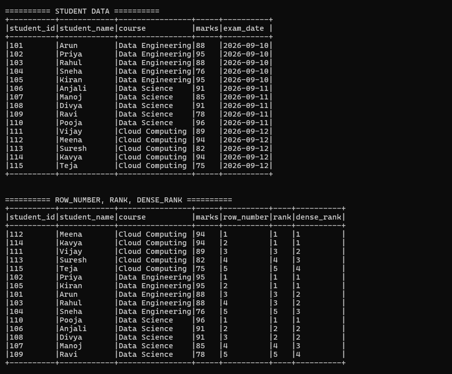
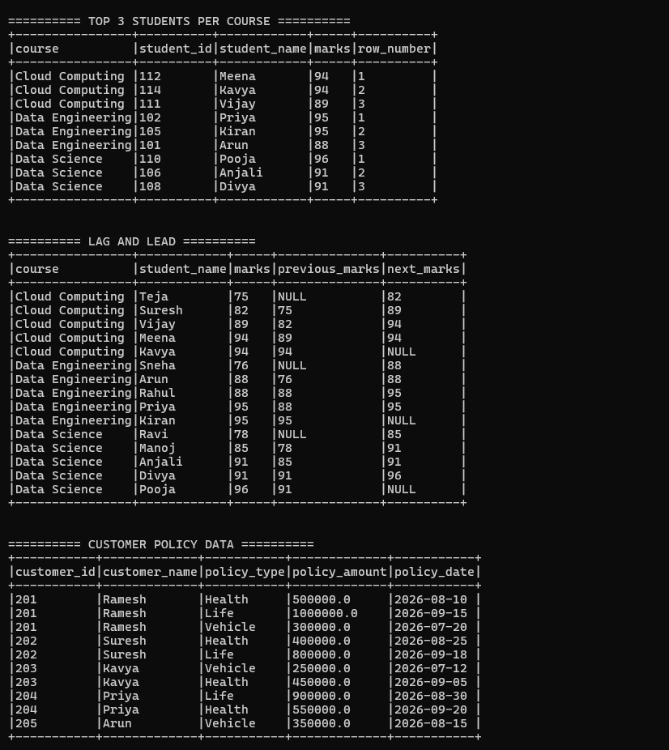
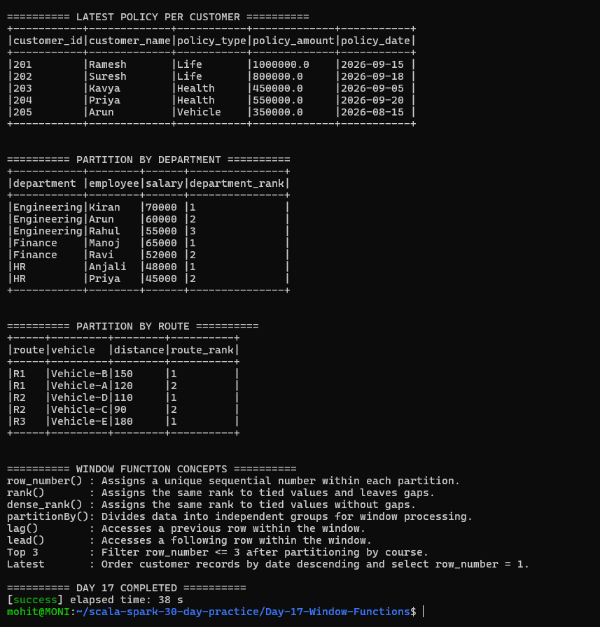

# Day 17 — Window Functions

## Objective

Practice Apache Spark Window Functions using Scala.

The main topics covered in this task are:

- row_number()
- rank()
- dense_rank()
- partitionBy()
- Finding the latest record per customer
- lag()
- lead()
- Finding Top 3 students per course
- Finding the latest policy for each customer

---

## Technologies Used

- Scala 2.12.18
- Apache Spark 3.5.6
- Spark SQL
- SBT 2.0.7
- Java 17
- WSL Ubuntu

---

## Project Structure

Day-17-Window-Functions/
├── data/
│   └── students.csv
├── project/
│   └── build.properties
├── screenshots/
│   ├── final_output1.png
│   ├── final_output2.png
│   └── final_output3.png
├── src/
│   └── main/
│       └── scala/
│           └── Main.scala
├── .gitignore
├── build.sbt
└── README.md

---

## Dataset

The project uses a student dataset containing:

- Student ID
- Student name
- Course
- Marks
- Exam date

Example courses:

- Data Engineering
- Data Science
- Cloud Computing

A second customer policy dataset is created inside the Scala program to demonstrate finding the latest policy for each customer.

---

# 1. row_number()

row_number() assigns a unique sequential number to every row within a window partition.

The students are partitioned by course and ordered by marks in descending order.

Example:

Data Engineering:

- Priya → 95 → row_number 1
- Kiran → 95 → row_number 2
- Arun → 88 → row_number 3
- Rahul → 88 → row_number 4
- Sneha → 76 → row_number 5

Even when marks are equal, row_number() gives different sequential numbers.

---

# 2. rank()

rank() gives the same rank to rows having the same value.

If two students have the same marks, they receive the same rank.

For example:

95 → rank 1
95 → rank 1
88 → rank 3

The next rank becomes 3 because rank() leaves gaps after ties.

---

# 3. dense_rank()

dense_rank() also gives the same rank to tied values, but it does not leave gaps.

For example:

95 → dense_rank 1
95 → dense_rank 1
88 → dense_rank 2

Therefore:

- rank() leaves gaps after ties.
- dense_rank() does not leave gaps.
- row_number() always assigns a unique sequential number.

---

# 4. partitionBy()

partitionBy() divides the data into logical groups before applying a window function.

This project demonstrates partitioning by:

- Course
- Customer
- Department
- Route

Example:

Window
  .partitionBy("course")
  .orderBy(desc("marks"))

This means that ranking starts separately for every course.

---

# 5. Top 3 Students Per Course

The ranked student DataFrame is filtered using:

filter(col("row_number") <= 3)

Because the window is partitioned by course, the result contains the top 3 students from every course.

Courses included:

- Cloud Computing
- Data Engineering
- Data Science

This demonstrates a common real-world Spark use case for finding the top N records within each group.

---

# 6. lag()

lag() accesses a previous row within the window.

Example:

lag("marks", 1).over(studentSequenceWindow)

The project uses lag() to find the previous student's marks within each course.

For the first row in a partition, there is no previous row, so the result is NULL.

---

# 7. lead()

lead() accesses a following row within the window.

Example:

lead("marks", 1).over(studentSequenceWindow)

The project uses lead() to find the next student's marks within each course.

For the last row in a partition, there is no following row, so the result is NULL.

---

# 8. Latest Record Per Customer

A customer policy dataset is created with multiple policy records for each customer.

The window is:

Window
  .partitionBy("customer_id")
  .orderBy(desc("policy_date"))

Then row_number() is applied to the customer partition.

The latest record is selected using:

filter(col("row_number") === 1)

This produces the latest policy for every customer.

Example:

- Ramesh → Life → 2026-09-15
- Suresh → Life → 2026-09-18
- Kavya → Health → 2026-09-05
- Priya → Health → 2026-09-20
- Arun → Vehicle → 2026-08-15

This is a common data engineering pattern for selecting the most recent record from historical data.

---

# 9. Partition By Department

A department employee dataset is used to demonstrate partitioning by department.

The window:

Window
  .partitionBy("department")
  .orderBy(desc("salary"))

is used to rank employees within each department.

Departments include:

- Engineering
- Finance
- HR

The ranking starts from 1 independently inside every department.

---

# 10. Partition By Route

A route dataset is also used.

The window:

Window
  .partitionBy("route")
  .orderBy(desc("distance"))

ranks vehicles independently within each route.

This demonstrates how window functions can be applied to transportation or route-based datasets.

---

# 11. Window Function Comparison

| Function | Purpose | Handles Ties |
|---|---|---|
| row_number() | Unique sequential number | Gives different numbers |
| rank() | Ranking based on values | Same rank, gaps after ties |
| dense_rank() | Ranking based on values | Same rank, no gaps |
| lag() | Access previous row | Returns NULL when unavailable |
| lead() | Access next row | Returns NULL when unavailable |

---

# 12. Important Window Function Syntax

General syntax:

val windowSpec = Window
  .partitionBy("column")
  .orderBy(desc("column"))

Then apply a window function:

row_number().over(windowSpec)

Other examples:

rank().over(windowSpec)

dense_rank().over(windowSpec)

lag("marks", 1).over(windowSpec)

lead("marks", 1).over(windowSpec)

---

# 13. Screenshots

## Window Ranking and Top 3

## Lag, Lead and Latest Policy

## Department, Route and Completion

---

# 14. Key Learnings

From this task, I learned:

1. How Spark Window Functions work.
2. How to use row_number().
3. How rank() handles duplicate values.
4. How dense_rank() differs from rank().
5. How partitionBy() creates independent groups.
6. How to find Top N records within each group.
7. How to find the latest record per customer.
8. How to use lag() to access previous records.
9. How to use lead() to access following records.
10. How window functions can be applied to student, customer, employee and route datasets.

---

# Conclusion

Day 17 successfully demonstrates Spark Window Functions using Scala.

The project covers ranking, partitioning, previous and next row analysis, latest-record selection, Top 3 students per course, department ranking, and route-based ranking.

The application completed successfully with all required window-function operations.