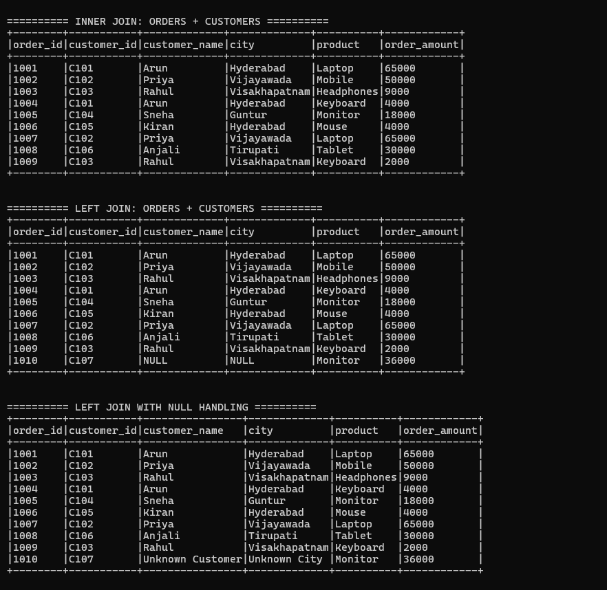
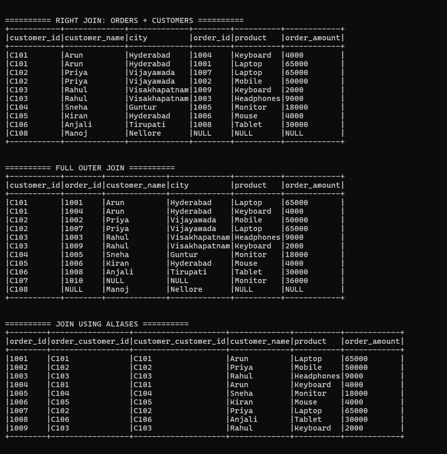
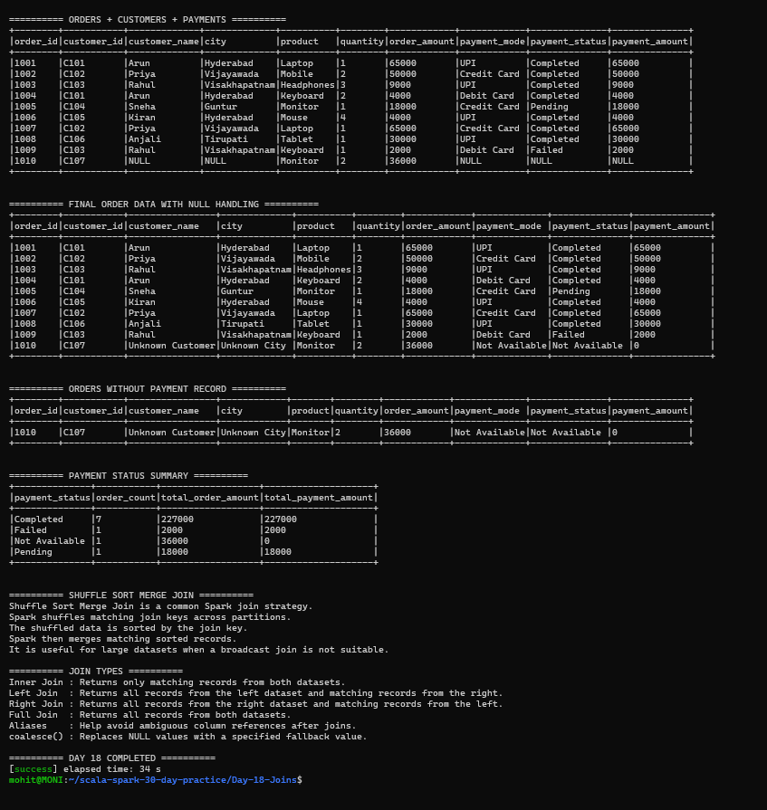

# Day 18 — Joins

## Objective

Practice Apache Spark Joins using Scala.

The main topics covered in this task are:

- Inner Join
- Left Join
- Right Join
- Full Outer Join
- Handling ambiguous column names using aliases
- Handling NULL values after left joins
- Shuffle Sort Merge Join
- Joining orders, customers, and payments

---

## Technologies Used

- Scala 2.12.18
- Apache Spark 3.5.6
- Spark SQL
- SBT 2.0.7
- Java 17
- WSL Ubuntu

---

## Project Structure

Day-18-Joins/
├── data/
│   ├── customers.csv
│   ├── orders.csv
│   └── payments.csv
├── project/
│   └── build.properties
├── screenshots/
│   ├── final_output1.png
│   ├── final_output2.png
│   └── final_output3.png
├── src/
│   └── main/
│       └── scala/
│           └── Main.scala
├── .gitignore
├── build.sbt
└── README.md

---

## Datasets

The project uses three datasets.

### Orders

The orders dataset contains:

- Order ID
- Customer ID
- Product
- Quantity
- Order amount
- Order date

### Customers

The customers dataset contains:

- Customer ID
- Customer name
- City
- Customer type

### Payments

The payments dataset contains:

- Payment ID
- Order ID
- Payment mode
- Payment status
- Payment amount

The datasets intentionally contain unmatched records to demonstrate different join behaviors.

For example:

- Customer C107 has an order but no customer record.
- Customer C108 exists but has no order.
- Order 1010 has no payment record.

---

# 1. Inner Join

An inner join returns only records that have matching keys in both datasets.

The project joins orders and customers using customer_id.

The join condition is:

orders.customer_id = customers.customer_id

The result contains orders for customers that exist in both datasets.

---

# 2. Left Join

A left join returns all records from the left dataset and matching records from the right dataset.

The project uses orders as the left dataset and customers as the right dataset.

Because customer C107 is missing from the customers dataset, order 1010 still appears in the result with NULL customer information.

This demonstrates how left joins preserve all records from the left side.

---

# 3. Null Handling After Left Join

The project uses coalesce() to replace NULL values.

Examples:

- NULL customer name → Unknown Customer
- NULL city → Unknown City
- NULL payment mode → Not Available
- NULL payment status → Not Available
- NULL payment amount → 0

This makes the final dataset easier to use for reporting and analysis.

---

# 4. Right Join

A right join returns all records from the right dataset and matching records from the left dataset.

The project uses customers as the right dataset.

Customer C108 does not have an order, so C108 appears with NULL order information.

This demonstrates how right joins preserve all records from the right side.

---

# 5. Full Outer Join

A full outer join returns all records from both datasets.

The project uses orders and customers.

The result includes:

- Matching orders and customers
- Order 1010 with customer C107 missing
- Customer C108 with no matching order

This allows us to identify unmatched records from both datasets.

---

# 6. Aliases for Ambiguous Columns

When two datasets contain columns with the same name, aliases can be used to avoid ambiguity.

The project creates aliases:

- orders → o
- customers → c
- payments → p

Example:

col("o.customer_id")

and:

col("c.customer_id")

Aliases make it clear which dataset a column belongs to.

They are especially useful when joining multiple DataFrames.

---

# 7. Joining Orders, Customers and Payments

The project performs a three-table join using:

Orders + Customers + Payments

The order data is first joined with customers using customer_id.

The result is then joined with payments using order_id.

The final dataset contains:

- Order ID
- Customer ID
- Customer name
- City
- Product
- Quantity
- Order amount
- Payment mode
- Payment status
- Payment amount

This represents a common data engineering scenario where information is distributed across multiple tables.

---

# 8. Handling Missing Payment Records

Order 1010 does not have a payment record.

After the left join, its payment fields are NULL.

The project replaces these values using coalesce():

- Payment mode → Not Available
- Payment status → Not Available
- Payment amount → 0

The project also filters these records to identify orders without payment records.

---

# 9. Payment Status Summary

The final dataset is grouped by payment status.

The project calculates:

- Order count
- Total order amount
- Total payment amount

The output contains payment statuses such as:

- Completed
- Failed
- Pending
- Not Available

This demonstrates how joins can be followed by aggregation for reporting.

---

# 10. Shuffle Sort Merge Join

Shuffle Sort Merge Join is a common Spark join strategy.

The basic process is:

1. Spark identifies the join keys.
2. Matching join keys are shuffled across partitions.
3. The shuffled data is sorted by the join key.
4. Spark merges matching sorted records.
5. The join result is produced.

It is useful for large datasets when a broadcast join is not suitable.

---

# 11. Join Type Comparison

| Join Type | Result |
|---|---|
| Inner Join | Only matching records from both datasets |
| Left Join | All left records + matching right records |
| Right Join | All right records + matching left records |
| Full Outer Join | All records from both datasets |

---

# 12. Important Functions and Concepts

### join()

Used to combine two or more DataFrames using a join condition.

### alias()

Used to assign a short name to a DataFrame and avoid ambiguous column references.

### col()

Used to reference a DataFrame column.

### coalesce()

Used to replace NULL values with a specified fallback value.

### groupBy()

Used to group records before performing aggregations.

### agg()

Used to perform aggregate calculations such as count() and sum().

---

# 13. Screenshots

## Inner Join, Left Join and Null Handling

## Right Join, Full Join and Aliases

## Three-Table Join and Final Analysis

---

# 14. Key Learnings

From this task, I learned:

1. How to perform inner joins in Spark.
2. How to perform left joins.
3. How to perform right joins.
4. How to perform full outer joins.
5. How to handle ambiguous column names using aliases.
6. How to handle NULL values using coalesce().
7. How to join three DataFrames together.
8. How to identify missing customer records.
9. How to identify orders without payment records.
10. How Shuffle Sort Merge Join works.
11. How joins can be combined with aggregations for reporting.

---

# Conclusion

Day 18 successfully demonstrates Apache Spark Joins using Scala.

The project covers inner, left, right and full outer joins, aliases for ambiguous columns, NULL handling, three-table joins, payment analysis and Shuffle Sort Merge Join concepts.

The application completed successfully with all required join operations.