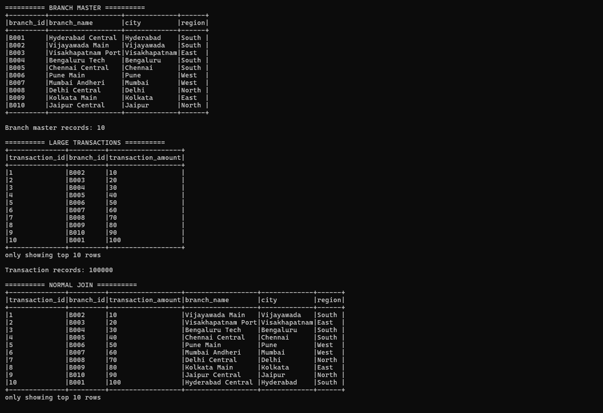
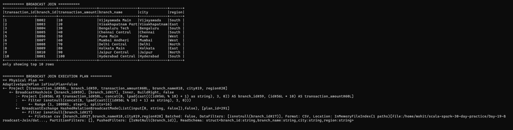
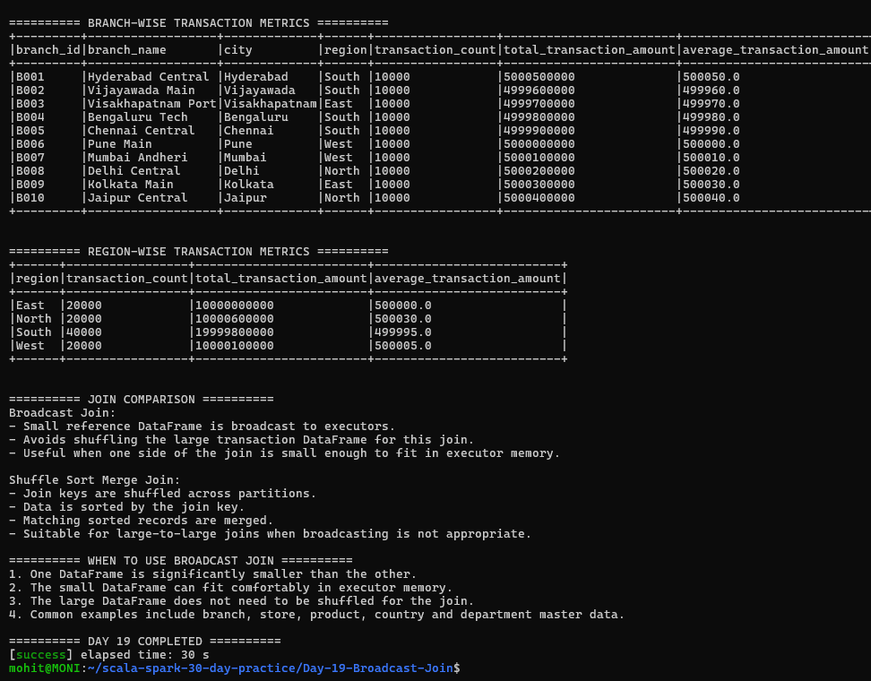

# Day 19 – Broadcast Join

## Objective

The objective of Day 19 is to understand and implement Broadcast Join in Apache Spark.

The following tasks were completed:

1. Created a large fact DataFrame containing 100,000 transaction records.
2. Created a small reference DataFrame containing branch master data.
3. Performed a normal inner join between transactions and branch master.
4. Implemented an explicit Broadcast Join using Spark's `broadcast()` function.
5. Verified the physical execution plan using `explain()`.
6. Calculated branch-wise transaction metrics.
7. Calculated region-wise transaction metrics.
8. Compared Broadcast Join with Shuffle Sort Merge Join.
9. Explained when Broadcast Join is appropriate.
10. Implemented a real-world scenario of joining a large transaction dataset with a small branch master.

---

## Technologies Used

- Scala 2.12.18
- Apache Spark 3.5.6
- Spark SQL
- sbt 2.0.7
- Java 17
- WSL2 Ubuntu

---

## Project Structure

Day-19-Broadcast-Join/
│
├── data/
│   └── branch_master.csv
│
├── screenshots/
│   ├── final_output1.png
│   ├── final_output2.png
│   └── final_output3.png
│
├── src/
│   └── main/
│       └── scala/
│           └── Main.scala
│
├── project/
│   └── build.properties
│
├── .gitignore
├── build.sbt
└── README.md

---

## Dataset

### Branch Master

The branch master is the small reference DataFrame.

It contains the following columns:

- `branch_id`
- `branch_name`
- `city`
- `region`

The dataset contains 10 branch records.

Example:

branch_id | branch_name | city | region
B001 | Hyderabad Central | Hyderabad | South
B002 | Vijayawada Main | Vijayawada | South
B003 | Visakhapatnam Port | Visakhapatnam | East

---

## Large Transaction DataFrame

A large transaction DataFrame was generated using Spark's `range()` function.

The DataFrame contains:

- `transaction_id`
- `branch_id`
- `transaction_amount`

Total transaction records:

100,000

The transaction branch IDs are generated between B001 and B010 so that the transactions can be joined with the branch master.

---

## Normal Join

A normal inner join was performed between the transaction DataFrame and branch master using `branch_id`.

The join combines transaction information with:

- branch name
- city
- region

The normal join successfully returned the expected transaction and branch information.

---

## Broadcast Join

Broadcast Join was implemented using Spark's `broadcast()` function.

The small branch master DataFrame is explicitly broadcast to the executors.

The broadcast DataFrame was joined with the large transaction DataFrame using `branch_id`.

This is useful when one side of the join is small enough to fit comfortably in executor memory.

---

## Broadcast Join Execution Plan

The execution plan was verified using:

broadcastJoin.explain()

The physical plan showed:

`BroadcastHashJoin`

and

`BroadcastExchange`

This confirms that Spark used a broadcast-based join strategy for the explicitly broadcast DataFrame.

---

## Why Broadcast Join?

Broadcast Join is useful when:

1. One DataFrame is significantly smaller than the other.
2. The small DataFrame can fit comfortably in executor memory.
3. The large DataFrame does not need to be shuffled for the join.
4. The join involves a small reference or master dataset.

Common examples include:

- Branch master
- Store master
- Product master
- Country master
- Department master

---

## Broadcast Join vs Shuffle Sort Merge Join

### Broadcast Join

- The small reference DataFrame is broadcast to executors.
- It avoids shuffling the large transaction DataFrame for this join.
- It is useful when one side of the join is small enough to fit in executor memory.
- Spark uses a Broadcast Hash Join execution strategy.

### Shuffle Sort Merge Join

- Join keys are shuffled across partitions.
- Data is sorted by the join key.
- Matching sorted records are merged.
- It is suitable for large-to-large joins when broadcasting is not appropriate.

---

## Business Scenario

### Scenario: Transaction Processing with Branch Master

Assume a banking or retail organization has millions of transaction records.

The transaction data contains:

- `transaction_id`
- `branch_id`
- `transaction_amount`

The organization also has a small branch master containing:

- `branch_id`
- `branch_name`
- `city`
- `region`

Instead of shuffling the large transaction dataset for the join, the small branch master can be broadcast to the executors.

This allows the transaction records to be enriched with branch information efficiently.

---

## Branch-wise Metrics

After the broadcast join, transaction metrics were calculated for every branch.

The following metrics were generated:

- Transaction count
- Total transaction amount
- Average transaction amount

Each of the 10 branches contains 10,000 transaction records in the generated dataset.

---

## Region-wise Metrics

Transactions were also grouped by region.

The following metrics were calculated:

- Transaction count
- Total transaction amount
- Average transaction amount

The generated output contains four regions:

- East
- North
- South
- West

---

## Important Spark Concepts

### Fact DataFrame

A fact DataFrame generally contains a large number of transactional or event records.

In this project:

`Transaction DataFrame = Fact DataFrame`

### Reference DataFrame

A reference DataFrame contains relatively small master or lookup information.

In this project:

`Branch Master DataFrame = Reference DataFrame`

### Broadcast

Broadcast distributes a small DataFrame to the executors so that it can be used locally during the join.

### BroadcastHashJoin

BroadcastHashJoin is the physical join strategy shown in the execution plan when Spark performs a broadcast hash join.

### BroadcastExchange

BroadcastExchange represents the stage where the small dataset is prepared for broadcasting.

---

## Key Learning

From this task, I learned:

- How Broadcast Join works in Spark.
- How to explicitly use the `broadcast()` function.
- How to verify the physical execution plan using `explain()`.
- Why small reference datasets are suitable for Broadcast Join.
- The difference between Broadcast Join and Shuffle Sort Merge Join.
- How a large transaction DataFrame can be joined with a small branch master.
- How to perform aggregations after a broadcast join.

---

## Execution

Run the project using:

sbt run

The application completed successfully with:

DAY 19 COMPLETED

---

## Output

The program successfully produced:

- Branch master data
- 100,000 transaction records
- Normal join output
- Broadcast join output
- Broadcast Hash Join execution plan
- Branch-wise transaction metrics
- Region-wise transaction metrics
- Broadcast Join vs Shuffle Sort Merge Join comparison
- Guidelines for using Broadcast Join

---

## Screenshots

### 1. Branch Master, Large Transactions and Normal Join

### 2. Broadcast Join and Execution Plan

### 3. Transaction Metrics and Join Comparison

---

## Conclusion

Day 19 successfully demonstrated Broadcast Join using Apache Spark.

A large transaction DataFrame was joined with a small branch master DataFrame using an explicit broadcast strategy. The physical execution plan confirmed the use of `BroadcastHashJoin` and `BroadcastExchange`.

The task also demonstrated how Broadcast Join can be used in practical data engineering scenarios where a large fact dataset needs to be enriched using a small reference or master dataset.