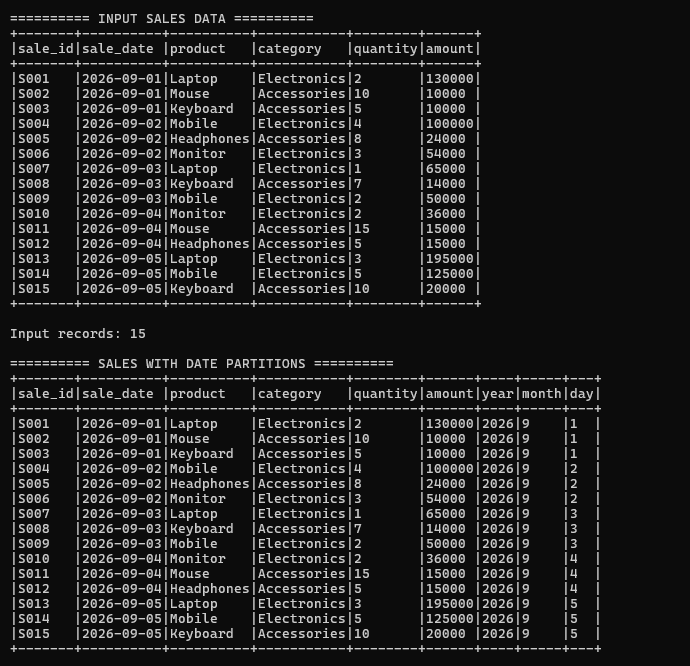
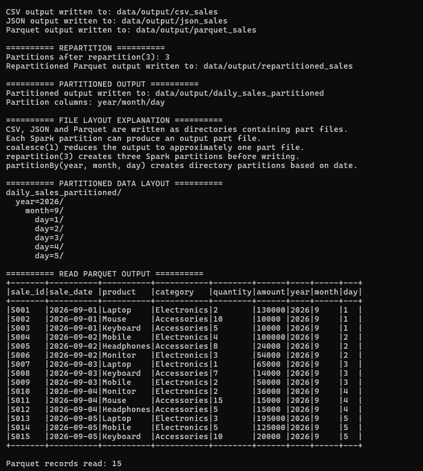
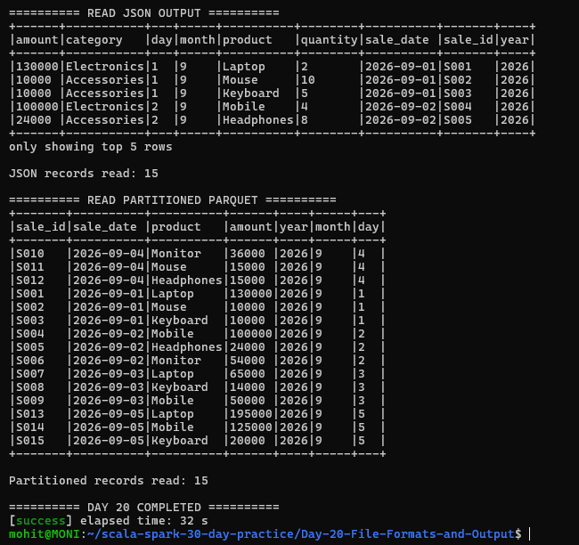

# Day 20 – File Formats and Output

## Objective

The objective of Day 20 is to understand how Apache Spark reads and writes different file formats and how data can be partitioned before writing.

The following tasks were completed:

1. Read and write CSV data.
2. Write data in JSON format.
3. Write and read Parquet data.
4. Write partitioned output.
5. Explain Spark file layout and the number of output files.
6. Practice `repartition()` before writing.
7. Implement a daily sales scenario partitioned by year, month and day.

---

## Technologies Used

- Scala 2.12.18
- Apache Spark 3.5.6
- Spark SQL
- sbt 2.0.7
- Java 17
- WSL2 Ubuntu

---

## Project Structure

Day-20-File-Formats-and-Output/
│
├── data/
│   ├── daily_sales.csv
│   └── output/
│
├── screenshots/
│   ├── final_output1.png
│   ├── final_output2.png
│   └── final_output3.png
│
├── src/
│   └── main/
│       └── scala/
│           └── Main.scala
│
├── project/
│   └── build.properties
│
├── .gitignore
├── build.sbt
└── README.md

---

## Dataset

The input dataset is a daily sales dataset containing:

- `sale_id`
- `sale_date`
- `product`
- `category`
- `quantity`
- `amount`

The dataset contains 15 sales records covering September 1 to September 5, 2026.

---

## Reading CSV

The sales data was read from a CSV file using Spark DataFrame API.

The CSV reader was configured with:

- Header enabled
- Schema inference enabled

The input successfully loaded 15 records.

---

## Adding Date Partition Columns

The `sale_date` column was converted to a date type.

Three additional columns were created:

- `year`
- `month`
- `day`

These columns are used to create a partitioned output structure.

For the dataset, the generated values are:

- year = 2026
- month = 9
- day = 1 to 5

---

## Writing CSV

The processed sales DataFrame was written in CSV format.

Output location:

data/output/csv_sales

The output was written using `coalesce(1)` to reduce the number of output partitions.

---

## Writing JSON

The processed sales DataFrame was also written in JSON format.

Output location:

data/output/json_sales

The JSON output was successfully created and later read back using Spark.

---

## Writing Parquet

The processed sales DataFrame was written in Parquet format.

Output location:

data/output/parquet_sales

Parquet output was successfully created and read back using Spark.

Parquet is a column-oriented file format commonly used in Spark data processing.

---

## Repartition Before Writing

The DataFrame was repartitioned using:

repartition(3)

The program verified that the resulting DataFrame contained:

3 partitions

The repartitioned data was then written as Parquet.

Output location:

data/output/repartitioned_sales

---

## Partitioned Output

The daily sales data was written using:

partitionBy("year", "month", "day")

The output was stored as Parquet.

Output location:

data/output/daily_sales_partitioned

The resulting logical directory structure is:

daily_sales_partitioned/
  year=2026/
    month=9/
      day=1/
      day=2/
      day=3/
      day=4/
      day=5/

This structure allows the data to be organized according to year, month and day.

---

## File Layout Explanation

Spark writes DataFrame output as directories containing part files rather than as a single normal file.

Each Spark partition can produce an output part file.

In this project:

- `coalesce(1)` was used to reduce the output to approximately one part file.
- `repartition(3)` created three Spark partitions before writing.
- `partitionBy(year, month, day)` created directory partitions based on the date columns.

The number of output files is influenced by the number of Spark partitions and the writing operation.

---

## Reading Parquet Output

The Parquet output was read back using Spark.

The program successfully read:

15 records

This verified that the Parquet output was written correctly.

---

## Reading JSON Output

The JSON output was also read back using Spark.

The program successfully read:

15 records

This verified that the JSON output was written correctly.

---

## Reading Partitioned Parquet

The partitioned Parquet output was read back using Spark.

The program successfully read:

15 records

The output included:

- sale_id
- sale_date
- product
- amount
- year
- month
- day

This confirmed that the partitioned data was written and read successfully.

---

## Business Scenario

### Daily Sales Data Partitioned by Date

A retail company generates sales data every day.

Instead of storing all sales records in one location, the data can be partitioned using:

- Year
- Month
- Day

For example:

daily_sales_partitioned/
  year=2026/
    month=9/
      day=1/
      day=2/
      day=3/
      day=4/
      day=5/

This organization makes the data easier to manage and allows Spark to work with specific date partitions when processing queries.

---

## Important Spark Concepts

### CSV

CSV is a text-based tabular file format where values are separated by delimiters.

### JSON

JSON stores data using a structured key-value representation.

### Parquet

Parquet is a column-oriented storage format designed for efficient analytical processing.

### Repartition

`repartition()` changes the number of partitions and performs a shuffle to redistribute the data.

In this project:

repartition(3)

created three partitions.

### Coalesce

`coalesce()` reduces the number of partitions without performing a full shuffle.

In this project:

coalesce(1)

was used before writing CSV, JSON and Parquet output.

### PartitionBy

`partitionBy()` organizes output into directory partitions based on selected columns.

In this project:

partitionBy("year", "month", "day")

was used to create daily sales partitions.

---

## Key Learning

From this task, I learned:

- How to read CSV data using Spark.
- How to write CSV output.
- How to write and read JSON data.
- How to write and read Parquet data.
- How `repartition()` changes the number of Spark partitions.
- How `coalesce()` can reduce the number of output partitions.
- How `partitionBy()` creates directory-based partitions.
- How Spark organizes output files.
- How to store daily sales data using year/month/day partitions.

---

## Execution

Run the project using:

sbt run

The application completed successfully with:

DAY 20 COMPLETED

---

## Output

The program successfully produced:

- CSV output
- JSON output
- Parquet output
- Repartitioned Parquet output
- Year/month/day partitioned Parquet output
- File layout explanation
- Partition count information
- Successfully read JSON output
- Successfully read Parquet output
- Successfully read partitioned Parquet output

---

## Screenshots

### 1. Input Sales Data and Date Partition Columns

### 2. File Formats, Repartition and File Layout

### 3. Reading Output Files and Completion

---

## Conclusion

Day 20 successfully demonstrated Spark file formats and output handling.

The project read sales data from CSV, wrote data in CSV, JSON and Parquet formats, practiced `repartition()` and `coalesce()`, and created a partitioned Parquet dataset using year, month and day.

The daily sales scenario demonstrated how Spark can organize large datasets into date-based partitions for structured data storage and processing.