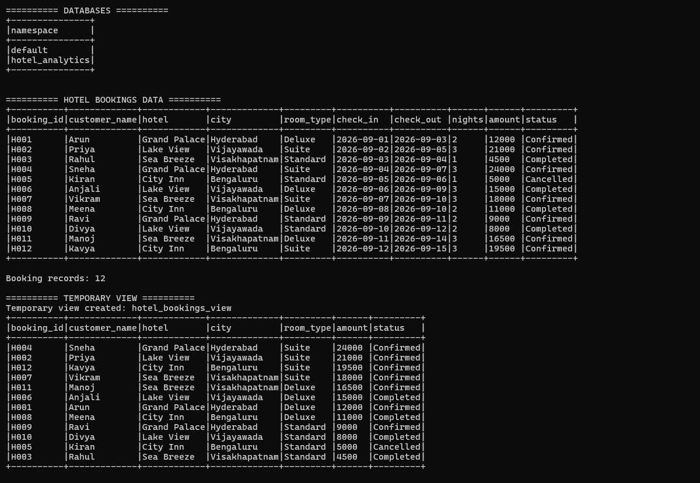
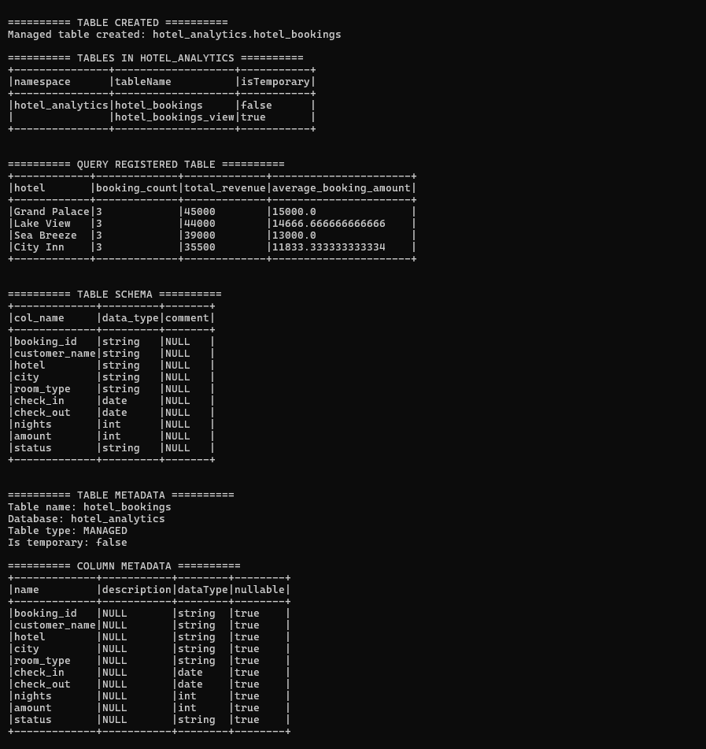
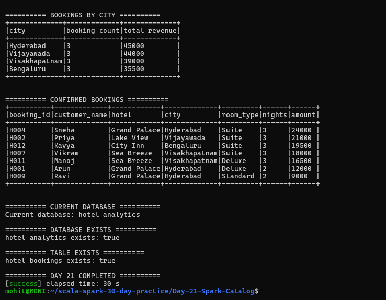

# Day 21 — Spark Catalog

## Objective

Practice Spark Catalog operations by creating and managing a small analytics database for hotel bookings.

## Assignment Requirements

1. List databases and tables.
2. Create temporary views.
3. Register and query tables.
4. Inspect table and schema metadata.
5. Build a small analytics database for hotel bookings.

## Technologies Used

- Scala 2.12.18
- Apache Spark 3.5.6
- Spark SQL
- sbt 2.0.7
- Java 17

## Project Structure

Day-21-Spark-Catalog/
├── data/
│   └── hotel_bookings.csv
├── project/
│   └── build.properties
├── screenshots/
│   ├── final_output1.png
│   ├── final_output2.png
│   └── final_output3.png
├── src/
│   └── main/
│       └── scala/
│           └── Main.scala
├── .gitignore
├── build.sbt
└── README.md

## Dataset

The project uses a small hotel booking dataset containing:

- Booking ID
- Customer name
- Hotel
- City
- Room type
- Check-in date
- Check-out date
- Number of nights
- Booking amount
- Booking status

Total booking records processed: 12

## Implementation

### 1. Create Spark Analytics Database

A Spark SQL database named `hotel_analytics` is created using:

spark.sql("CREATE DATABASE IF NOT EXISTS hotel_analytics")

The database is then selected for the remaining Spark SQL operations.

### 2. List Databases

Spark Catalog is used to display the available databases.

The output shows:

- default
- hotel_analytics

### 3. Read Hotel Booking Data

The CSV file is read into a Spark DataFrame using:

- Header enabled
- Schema inference enabled

The complete hotel booking dataset is displayed and the number of records is verified.

### 4. Create Temporary View

A temporary SQL view named `hotel_bookings_view` is created from the DataFrame.

The view is queried using Spark SQL to display booking information ordered by booking amount.

The temporary view is session-scoped and is not stored as a permanent table.

### 5. Create Managed Table

The booking DataFrame is registered as a managed Spark SQL table:

`hotel_analytics.hotel_bookings`

The table is created using `saveAsTable()`.

### 6. List Tables

Spark Catalog is used to list the tables in the `hotel_analytics` database.

The output contains:

- hotel_bookings — managed table
- hotel_bookings_view — temporary view

### 7. Query Registered Table

The registered `hotel_bookings` table is queried using Spark SQL.

Hotel-wise analytics are calculated:

- Booking count
- Total revenue
- Average booking amount

Results:

- Grand Palace — 3 bookings — 45000 total revenue
- Lake View — 3 bookings — 44000 total revenue
- Sea Breeze — 3 bookings — 39000 total revenue
- City Inn — 3 bookings — 35500 total revenue

### 8. Inspect Table Schema

The table schema is inspected using:

DESCRIBE hotel_bookings

The schema contains:

- booking_id — string
- customer_name — string
- hotel — string
- city — string
- room_type — string
- check_in — date
- check_out — date
- nights — int
- amount — int
- status — string

### 9. Inspect Table Metadata

Spark Catalog API is used to inspect table metadata.

The output confirms:

- Table name: hotel_bookings
- Database: hotel_analytics
- Table type: MANAGED
- Is temporary: false

### 10. Inspect Column Metadata

Spark Catalog API is used to list column metadata.

The information includes:

- Column name
- Description
- Data type
- Nullable property

### 11. Analyze Bookings by City

Bookings are grouped by city to calculate:

- Booking count
- Total revenue

Results:

- Hyderabad — 3 bookings — 45000 total revenue
- Vijayawada — 3 bookings — 44000 total revenue
- Visakhapatnam — 3 bookings — 39000 total revenue
- Bengaluru — 3 bookings — 35500 total revenue

### 12. Query Confirmed Bookings

The registered table is queried to retrieve bookings whose status is `Confirmed`.

The output displays:

- Booking ID
- Customer name
- Hotel
- City
- Room type
- Number of nights
- Amount

### 13. Verify Catalog Information

The Spark Catalog API is used to verify:

- Current database
- Whether `hotel_analytics` exists
- Whether `hotel_bookings` exists

The final output confirms:

`Current database: hotel_analytics`

`hotel_analytics exists: true`

`hotel_bookings exists: true`

## How to Run

Open the WSL terminal and navigate to the project:

cd ~/scala-spark-30-day-practice/Day-21-Spark-Catalog

Run the Spark application:

sbt run

## Expected Result

The application should successfully display:

1. Available databases
2. Hotel booking data
3. Temporary view output
4. Created managed table
5. Available tables
6. Hotel-wise revenue analytics
7. Table schema
8. Table metadata
9. Column metadata
10. City-wise booking analytics
11. Confirmed bookings
12. Current database information
13. Database and table existence checks

The final output should contain:

DAY 21 COMPLETED

## Screenshots

### Screenshot 1 — Database, Dataset and Temporary View

This screenshot shows:

- Available databases
- Hotel booking dataset
- Booking record count
- Temporary view creation
- Temporary view query output

### Screenshot 2 — Table and Metadata

This screenshot shows:

- Managed table creation
- Tables in `hotel_analytics`
- Registered table query
- Table schema
- Table metadata
- Column metadata

### Screenshot 3 — Analytics and Completion

This screenshot shows:

- Bookings by city
- Confirmed bookings
- Current database
- Database existence check
- Table existence check
- `DAY 21 COMPLETED`

## Learning Outcomes

By completing this task, I practiced:

- Spark Catalog
- Spark SQL databases
- Listing databases and tables
- Temporary views
- Managed tables
- saveAsTable()
- SQL queries on registered tables
- DESCRIBE command
- Table metadata inspection
- Column metadata inspection
- Catalog API
- Database and table existence checks
- Basic hotel booking analytics

## Conclusion

Day 21 successfully demonstrated Spark Catalog operations by creating a small hotel analytics database, registering a managed table and temporary view, querying the data using Spark SQL, and inspecting table and column metadata using Spark Catalog APIs.
