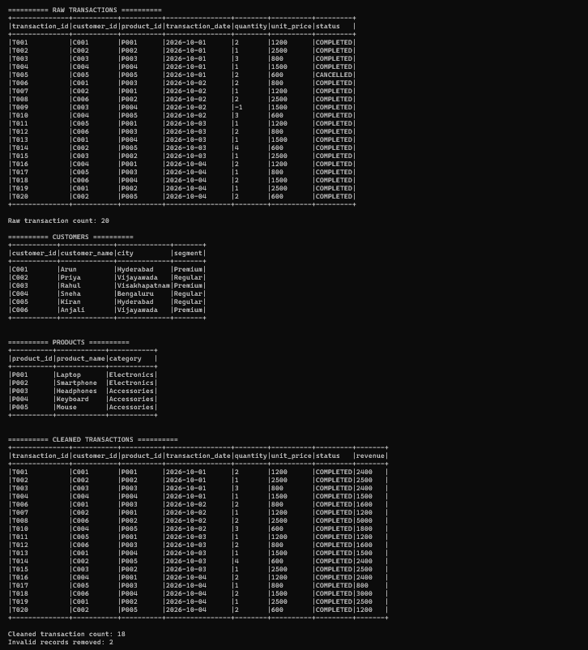
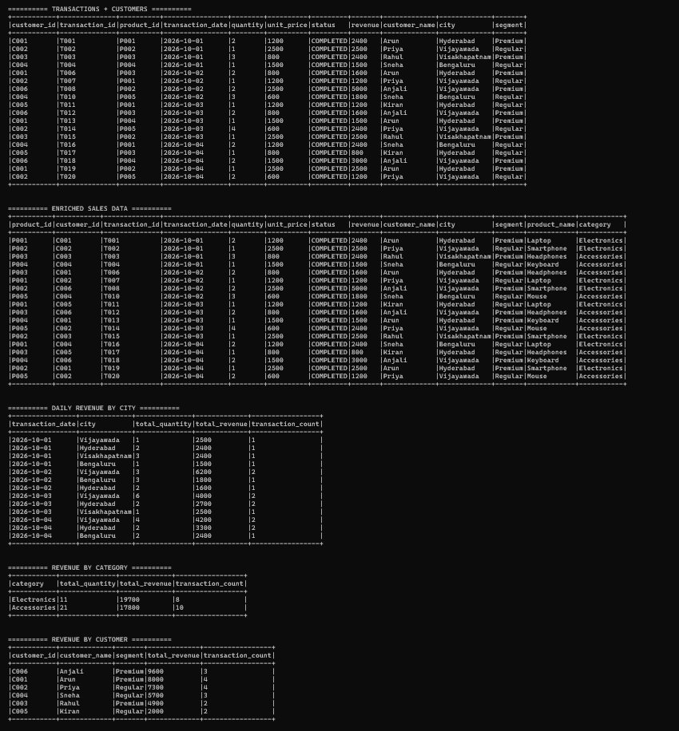
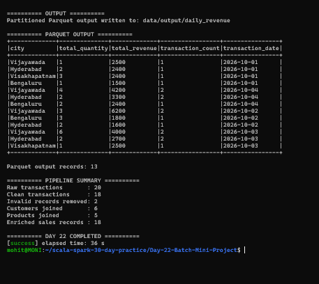

# Day 22 — Batch Mini Project

## Objective

Build an end-to-end Spark batch pipeline for an e-commerce daily sales scenario.

The pipeline reads raw transaction data, cleans invalid records, joins customer and product master data, calculates revenue metrics, and writes the final results as partitioned Parquet output.

## Assignment Requirements

1. Build an end-to-end batch pipeline.
2. Read raw transactions.
3. Clean invalid records.
4. Join customer and product data.
5. Aggregate revenue and write partitioned Parquet output.
6. Implement an e-commerce daily sales pipeline scenario.

## Technologies Used

- Scala 2.12.18
- Apache Spark 3.5.6
- Spark SQL
- sbt 2.0.7
- Java 17
- CSV
- Parquet

## Project Structure

Day-22-Batch-Mini-Project/
├── data/
│   ├── transactions.csv
│   ├── customers.csv
│   └── products.csv
├── project/
│   └── build.properties
├── screenshots/
│   ├── final_output1.png
│   ├── final_output2.png
│   └── final_output3.png
├── src/
│   └── main/
│       └── scala/
│           └── Main.scala
├── .gitignore
├── build.sbt
└── README.md

## Dataset

The project uses three CSV files.

### Transactions

The raw transaction dataset contains:

- transaction_id
- customer_id
- product_id
- transaction_date
- quantity
- unit_price
- status

Total raw transactions: 20

### Customers

The customer master dataset contains:

- customer_id
- customer_name
- city
- segment

Total customers: 6

### Products

The product master dataset contains:

- product_id
- product_name
- category

Total products: 5

## Batch Pipeline

The complete pipeline follows these stages:

Raw Transactions

→ Data Cleaning

→ Customer Join

→ Product Join

→ Revenue Calculation

→ Revenue Aggregation

→ Partitioned Parquet Output

→ Read and Verify Output

## Implementation

### 1. Read Raw Transaction Data

The Spark application reads the raw transaction CSV using Spark DataFrame APIs.

Schema inference and CSV headers are enabled.

The raw transaction count is:

20

The customer and product master datasets are also loaded into Spark DataFrames.

### 2. Clean Invalid Records

The raw transactions are filtered to keep only:

- COMPLETED transactions
- Positive quantities
- Positive unit prices

Revenue is calculated using:

revenue = quantity × unit_price

The cleaning stage produces:

- Raw transactions: 20
- Clean transactions: 18
- Invalid records removed: 2

The invalid records include cancelled transactions and a transaction with a negative quantity.

### 3. Join Customer Data

The cleaned transaction DataFrame is joined with the customer master DataFrame using:

customer_id

This enriches every transaction with:

- Customer name
- City
- Customer segment

The customer join produces 18 enriched transaction records.

### 4. Join Product Data

The customer-enriched transaction DataFrame is then joined with the product master DataFrame using:

product_id

This adds:

- Product name
- Product category

The final enriched sales dataset contains:

18 records

### 5. Calculate Revenue

For each valid transaction:

revenue = quantity × unit_price

This revenue value is used for the following aggregations.

### 6. Daily Revenue by City

The pipeline groups the enriched sales data by:

- transaction_date
- city

The following metrics are calculated:

- Total quantity
- Total revenue
- Transaction count

This produces daily city-level sales analytics.

### 7. Revenue by Product Category

The pipeline groups sales by product category and calculates:

- Total quantity
- Total revenue
- Transaction count

The resulting category revenue is:

- Electronics — 19700
- Accessories — 17800

### 8. Revenue by Customer

The pipeline groups the enriched data by:

- customer_id
- customer_name
- segment

The following metrics are calculated:

- Total revenue
- Transaction count

The highest customer revenue results include:

- Anjali — 9600
- Arun — 8000
- Priya — 7300
- Sneha — 5700
- Rahul — 4900
- Kiran — 2900

### 9. Write Partitioned Parquet Output

The daily revenue DataFrame is written as Parquet using:

partitionBy("transaction_date")

The output location is:

data/output/daily_revenue

This creates a partitioned Parquet layout based on transaction date.

The generated output is excluded from Git tracking using `.gitignore`.

### 10. Read Parquet Output

The generated Parquet data is read back into a Spark DataFrame.

The output contains:

- city
- total_quantity
- total_revenue
- transaction_count
- transaction_date

The Parquet output contains:

13 records.

This confirms that the batch pipeline successfully produced and read the partitioned output.

## Pipeline Summary

The final pipeline execution produced:

- Raw transactions: 20
- Clean transactions: 18
- Invalid records removed: 2
- Customers joined: 6
- Products joined: 5
- Enriched sales records: 18
- Parquet output records: 13

## How to Run

Open the WSL terminal and navigate to the project:

cd ~/scala-spark-30-day-practice/Day-22-Batch-Mini-Project

Run the Spark application:

sbt run

## Expected Result

The application should display:

1. Raw transactions
2. Customer master data
3. Product master data
4. Cleaned transactions
5. Transactions joined with customers
6. Enriched sales data
7. Daily revenue by city
8. Revenue by category
9. Revenue by customer
10. Partitioned Parquet output
11. Parquet output read-back
12. Pipeline summary
13. DAY 22 COMPLETED

## Screenshots

### Screenshot 1 — Raw Data and Cleaning

This screenshot shows:

- Raw transactions
- Customer data
- Product data
- Cleaned transactions
- Raw transaction count
- Clean transaction count
- Invalid records removed

### Screenshot 2 — Enrichment and Revenue Analytics

This screenshot shows:

- Transactions joined with customers
- Enriched sales data
- Daily revenue by city
- Revenue by category
- Revenue by customer

### Screenshot 3 — Parquet Output and Completion

This screenshot shows:

- Partitioned Parquet output
- Parquet data read-back
- Parquet output record count
- Pipeline summary
- DAY 22 COMPLETED

## Learning Outcomes

By completing this project, I practiced:

- Building an end-to-end Spark batch pipeline
- Reading CSV data using Spark
- Data cleaning with DataFrame filters
- Creating derived columns
- Joining multiple DataFrames
- Revenue calculation
- GroupBy aggregations
- Daily sales analytics
- Category-level analytics
- Customer-level analytics
- Writing Parquet files
- Partitioning Parquet output
- Reading Parquet output
- Validating batch pipeline results

## Conclusion

Day 22 successfully implemented an end-to-end e-commerce batch processing pipeline using Apache Spark.

The pipeline reads raw transactions, removes invalid records, enriches transactions using customer and product master data, calculates revenue metrics, generates sales analytics, and writes the final results as partitioned Parquet output.
