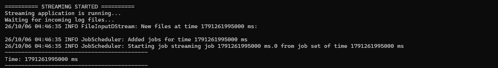
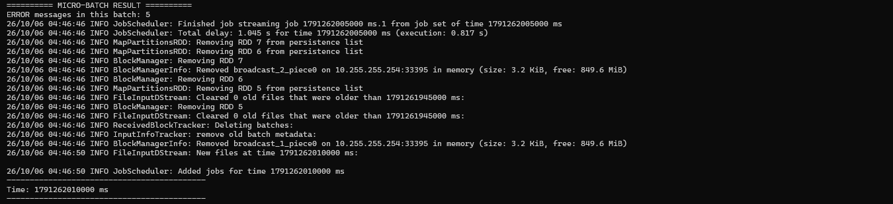
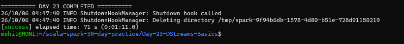

# Day 23 — DStreams Basics

## Overview

This project demonstrates the fundamentals of **Spark DStreams (Discretized Streams)** using Apache Spark Streaming.

The application simulates a streaming log-processing system that monitors application log files and counts `ERROR` messages in every micro-batch.

---

## Assignment Requirements

1. Create a Streaming Context and define a batch interval.
2. Read a socket/text stream.
3. Apply `map`, `filter`, and `flatMap`.
4. Explain micro-batch processing.
5. Scenario: Stream application logs and count `ERROR` messages every interval.

---

## Technologies Used

- Scala 2.12.18
- Apache Spark 3.5.6
- Spark Core
- Spark Streaming
- SBT
- WSL Ubuntu

---

## Project Structure

Day-23-DStreams-Basics/
│
├── build.sbt
├── .gitignore
├── README.md
│
├── data/
│   ├── application.log
│   └── stream_input/
│
├── project/
│   └── build.properties
│
├── screenshots/
│   ├── final_output1.png
│   ├── final_output2.png
│   └── final_output3.png
│
└── src/
    └── main/
        └── scala/
            └── Main.scala

---

## Objective

The objective of this task is to understand how Spark Streaming processes continuously arriving data using DStreams.

The application:

- Creates a Spark Streaming Context.
- Uses a 5-second batch interval.
- Reads application log files using a text stream.
- Filters log records containing `ERROR`.
- Uses `map` to convert each error message into `1`.
- Uses `reduce` to calculate the total number of errors.
- Uses `flatMap` for word-level processing.
- Processes data in micro-batches.
- Displays the number of `ERROR` messages detected in each batch.

---

## Spark Streaming Context

A `StreamingContext` is created with a batch interval of 5 seconds.

The batch interval determines how frequently Spark collects incoming streaming data and creates a new micro-batch.

The application uses:

- Master: `local[2]`
- Batch interval: `5 seconds`

---

## Stream Source

The application uses Spark's `textFileStream()` to monitor a directory for newly arriving text files.

The streaming input directory is:

`data/stream_input`

A new log file is copied into this directory while the streaming application is running.

Example:

`stream_batch_01.log`

This allows Spark to detect the newly created file and process it as a streaming batch.

---

## Sample Log Data

The application log contains different types of application messages:

- INFO
- WARN
- ERROR

Example log records include:

- Application started
- User login successful
- Database connection failed
- Payment service unavailable
- File not found
- Authentication service failed
- Network timeout

The sample input contains **5 ERROR messages**.

---

## DStream Transformations

### 1. flatMap

`flatMap` is used to split each log line into individual words.

Conceptually:

`log line → words`

This demonstrates how a DStream can be transformed from lines into individual tokens.

---

### 2. filter

The `filter` transformation selects only log lines containing the word `ERROR`.

Conceptually:

`All log lines → ERROR log lines`

Example:

`ERROR Database connection failed`

is selected, while:

`INFO Application started`

is ignored.

---

### 3. map

After filtering the ERROR messages, `map` converts every ERROR record into the value `1`.

Conceptually:

`ERROR message → 1`

For example:

`ERROR Database connection failed → 1`

`ERROR Payment service unavailable → 1`

`ERROR File not found → 1`

---

### 4. reduce

The values produced by `map` are combined using `reduce`.

For five ERROR messages:

`1 + 1 + 1 + 1 + 1 = 5`

Therefore:

`ERROR messages in this batch: 5`

---

## Micro-Batch Processing

DStreams process streaming data using **micro-batches**.

Instead of processing every incoming record individually, Spark collects data for a configured time interval and processes that data as a batch.

In this project:

`Batch interval = 5 seconds`

The processing flow is:

Application log files

↓

DStream

↓

5-second micro-batch

↓

filter ERROR messages

↓

map each ERROR to 1

↓

reduce the values

↓

ERROR count

For the test input, the result was:

`ERROR messages in this batch: 5`

---

## Why DStreams Use Micro-Batches

Micro-batch processing allows Spark Streaming to process continuously arriving data while still using Spark's distributed processing model.

Each time interval produces a new batch, and Spark processes that batch as an RDD.

---

## Scenario: Application Log Monitoring

This project represents a simple real-world application monitoring system.

Suppose an application continuously generates logs:

- INFO messages represent normal operations.
- WARN messages represent potential issues.
- ERROR messages represent failures.

The streaming application monitors these logs and counts ERROR messages every 5 seconds.

This can help identify application failures and monitor system health.

---

## Example Output

The application successfully produced:

`========== MICRO-BATCH RESULT ==========`

`ERROR messages in this batch: 5`

This confirms that the streaming application detected all 5 ERROR messages from the input file.

---

## Important Implementation Detail

Spark's `textFileStream()` monitors a directory for newly created files.

Therefore, the test log file is copied into:

`data/stream_input/`

while the streaming application is already running.

The static sample file remains in:

`data/application.log`

The streaming test file is intentionally excluded from Git using `.gitignore`.

---

## Screenshots

### Streaming Started

The first screenshot shows the streaming application starting successfully and waiting for incoming log files.

### Micro-Batch Result

The second screenshot shows the micro-batch processing result:

`ERROR messages in this batch: 5`

### Completion

The third screenshot shows the successful completion of the Day 23 application.

---

## Key Concepts Learned

- Spark Streaming
- DStreams
- StreamingContext
- Batch interval
- Micro-batch processing
- textFileStream
- map
- filter
- flatMap
- reduce
- RDD-based stream processing
- Application log monitoring

---

## How to Run

Navigate to the project directory:

`cd ~/scala-spark-30-day-practice/Day-23-DStreams-Basics`

Start the Spark Streaming application:

`sbt run`

Wait for:

`========== STREAMING STARTED ==========`

Then, from another terminal, copy a new log file into the streaming directory:

`cp data/application.log data/stream_input/stream_batch_01.log`

Spark detects the new file during the next micro-batch.

The application produces:

`ERROR messages in this batch: 5`

---

## Expected Result

The streaming application should successfully:

- Create the Streaming Context.
- Use a 5-second batch interval.
- Monitor the streaming input directory.
- Detect newly arriving log files.
- Filter ERROR messages.
- Count ERROR messages.
- Process data using micro-batches.
- Complete the Day 23 task successfully.

---

## Conclusion

Day 23 demonstrates the basic working principles of Spark DStreams.

The project shows how application logs can be processed as a stream, transformed using `flatMap`, `filter`, and `map`, and aggregated using `reduce`.

The final test successfully detected:

**5 ERROR messages in one micro-batch.**

========== DAY 23 COMPLETED ==========